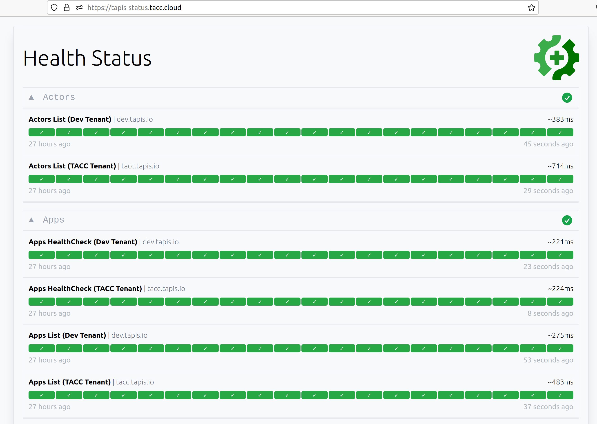

.. _administration:

====================
Tapis Administration
====================

.. note::

    This guide is for users wanting to deploy Tapis software in their own datacenter. Researchers who 
    simply want to make use of the Tapis APIs do not need to deploy any Tapis components and can ignore
    this guide.  

In this section, we cover common administration tasks that arise when operating Tapis 
software. 

*This section is under construction...*

----------------
Monitoring Tapis
----------------

We recommend two approaches for monitoring the health and status of your Tapis installation:

1. Tapis Status Page/Dashboard: A simple web application that runs HTTP requests on a configurable 
   time interval and checks the basic health of each service. The dashboard provides an overview
   page with green/red statuses allowing an administrator to get a quick look at the health of all
   services. 

2. Monitoring Tests: A configurable suite of HTTP-based integration tests that can run on a time
   interval and perform more elaborate verification. For example, monitoring tests might ensure that 
   Tapis functions can execute, small files can be transferred, and "hello world" jobs can be launched 
   on specific systems. 

While the needs for both monitorin items tend to be site-specific, the Tapis projects provides solutions
for both 1) and 2) as open source repositories available to the community. 

~~~~~~~~~~~~~~~~~
Tapis Status Page
~~~~~~~~~~~~~~~~~

A configurable Tapis Status application based on the Gatus project is available on GitHub; see 
the admin `repository <https://github.com/tapis-project/admin/tree/master/status>`_. We recommend
deploying the status application outside of the network where Tapis itself is running so that any 
network issues will be detected. The status page for the TACC Tapis installation is hosted on AWS
at https://tapis-status.tacc.cloud. Here is a screen shot of the status application:

Please see the README in the link included above for detailed instructions on configuring and 
deploying the Tapis status application.

~~~~~~~~~~~~~~~~~~~~~~~
Tapis Monitoring Tests
~~~~~~~~~~~~~~~~~~~~~~~

A configurable suite of tests is available on GitHub; see the 
`tapis-tests <https://github.com/tapis-project/tapis-tests>`_ repository. 
This repository contains test suites that can be used to validate a Tapis installation. There are two types of 
tests included in each of the subdirectories in the repository. The ``smoke_tests`` folder containers basic
checks of the functionality of each service. The tests are written in BASH and utilize the curl HTTP client.
There is significant overlap between these tests and the Tapis Status application, mentioned above, and in 
many cases using only one or the other is likely to be sufficient. Some projects may prefer the BASH/curl 
approach of the smoke tests to the Status App. 

The other type of test included is contained in the ``integration_tests`` folder. These tests make 
more elaborate checks of the Tapis functionality than that checked by the smoke tests, including submitting jobs
and monitoring that the jobs complete. These tests will require some configuration unique to each site (for example, 
an execution system to use to run the jobs). Also, unlike the smoke tests, the integration tests use Python and the 
Tapis Python SDK (tapipy). Please see the README in the repository for more details. 

--------------------------
Troubleshooting Tapis Pods
--------------------------

Troubleshooting Tapis pods can be challenging. In this section, we provide some initial steps administrators 
can take to uncover the root cause of issues, but the core Tapis team is always available to help 
institutions troubleshoot problems with their Tapis installation.

Step 1. Running the verification scripts.

Step 2. Determine which Tapis pod might be causing the problem. 

Step 3. Looking at the logs of a specific Tapis pod.

----------------
Backing Up Tapis
----------------

For any production deployment of Tapis, administrators should arrange for regular backups of all 
databases to occur. The frequency of the backup procedure, where to store backup files and how long 
to store them, among other aspects, are highly dependent on the requirements of the site. Nevertheless,
all sites have one thing in common: backups are required to prevent catastrophic data loss.

Tapis uses a number of different database technologies, including InfluxDB, MySQL, MongoDB, Postgres, 
Redis, and Vault. Each technology requires its own backup and restoration procedure.

Except for Vault, which is treated separately in its own section, and MongoDB, for which we provide a 
dedicated GitHub repository due to its complexity, all of the database backup procedures 
follow a common pattern:

1. Fetch necessary secrets out of Kubernetes for direct access to the database. 
2. Exec into the database container and execute a backup command to produce a dump file. 
3. Save the dump file to a secure place.

At TACC, for 3) we have opted to use an AWS S3 bucket. 

Below we provide templates of the backup command we use for each technology.

* InfluxDB (only used by Streams API): ``influxd backup -portable /path/to/file``
* MySQL (only used by Streams and Workflows API): ``mysqldump --all-databases > /path/to/file``
* MongoDB (only used by Meta and Actors API): See the GitHub repository `tapis/mongodb-backup <https://github.com/tapis-project/mongodb-backup>`_
* Postgres (used by Authenticator, Apps, Files, Jobs, Notifications, PgREST, Pods, SK, Systems, and Tenants API): ``pg_dump --dbname={service_db} > /path/to/file``
* Vault (only used by SK API): See the `Vault Backup <vault.html#vault-backup>`_ section.

.. note:: 

    Be aware that Deployer manipulates and stores Vault keys and a Vault root token in files.  
    Please refer to the Vault guidelines on the safekeeping and handling of these.  If 
    starting the Vault with the Deployer "burnup" script, in the absence of the file 
    containing the Vault keys, you will be prompted for Vault keys.  However, a file 
    containing a Vault root token will be required.

    --------------------------------
    Configuring Tenant Signing keys
    --------------------------------

    --------------------------
    Configuring Authenticators
    --------------------------

    -----------------
    Creating Tenants 
    -----------------

.. # commented for now ---
    .. note::
        Creating tenants is an action performed at a primary site. If you run an associate site 
        and need a new tenant created, contact your primary site administrators. 

