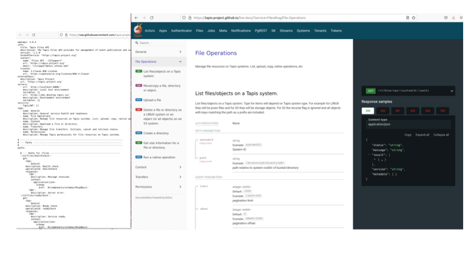
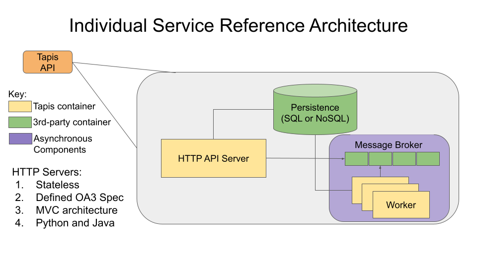

.. _architecture:

================================
Tapis Artifacts & Architecture
================================

In this section we provide an overview of the Tapis system architecture and a reference to all 
Tapis artifacts and code repositories. 

------------------
API Specification
------------------
Tapis consists of independent services communicating with each other via the HTTP protocol. Each 
Tapis service specifies its API contract using `Open API v3 <https://swagger.io/specification/>`_: 

A complete listing of the API contracts  for all Tapis services is available from the 
`Tapis Live Docs <https://tapis-project.github.io/live-docs>`_ website. 

All Tapis services as well as the official tooling, including the Tapis CLI and Python SDK, make use of 
the service API specifications internally. 

---------------------------
Micro-Service Architecture
---------------------------
While each Tapis service is developed independently, for the most part, services adhere to the 
following reference architecture:

-------------------------------
Artifacts and Code Repositories
-------------------------------

Below we list the primary Tapis service code repositories and their associate container images.

*This section is a work in progress...*

+---------------+-------------------------------------------------+-------------------------------------------------------+---------------------------------------------------------+
| Service       | Primary Repository                              |   Additional Repositories                             |   Container Image(s)                                    |
+===============+=================================================+=======================================================+=========================================================+
| Apps          | https://github.com/tapis-project/tapis-apps     | https://github.com/tapis-project/tapis-shared-java    | https://hub.docker.com/r/tapis/apps                     |
+---------------+-------------------------------------------------+-------------------------------------------------------+---------------------------------------------------------+
| Authenticator | https://github.com/tapis-project/authenticator  | https://github.com/tapis-project/tapipy               | https://hub.docker.com/r/tapis/authenticator            |
|               |                                                 |                ~~~                                    |                                                         |
|               |                                                 | https://github.com/tapis-project/tapipy-tapisservice  | https://hub.docker.com/r/tapis/authenticator-migrations |
+---------------+-------------------------------------------------+-------------------------------------------------------+---------------------------------------------------------+                                                           
| Tenants       | https://github.com/tapis-project/tenants-api    | https://github.com/tapis-project/tapipy               | https://hub.docker.com/r/tapis/tenants-api              |
|               |                                                 |                ~~~                                    |                     ~~~                                 |
|               |                                                 | https://github.com/tapis-project/tapipy-tapisservice  | https://hub.docker.com/r/tapis/tenants-api-migrations   |
+---------------+-------------------------------------------------+-------------------------------------------------------+---------------------------------------------------------+                                                           
| Tokens        | https://github.com/tapis-project/tokens-api     | https://github.com/tapis-project/tapipy               | https://hub.docker.com/r/tapis/tokens-api               |
|               |                                                 |                ~~~                                    |                                                         |
|               |                                                 | https://github.com/tapis-project/tapipy-tapisservice  |                                                         |
+---------------+-------------------------------------------------+-------------------------------------------------------+---------------------------------------------------------+                                                           
