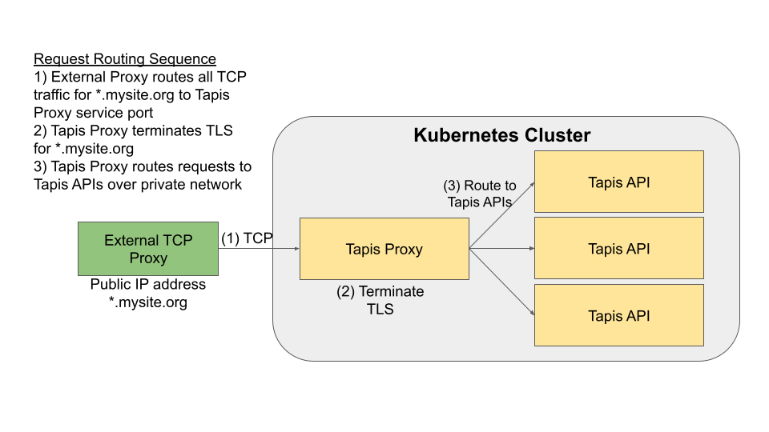

.. _preliminaries:

=======================================
Considerations and Prerequisites
=======================================

.. note::

    This guide is for users wanting to deploy Tapis software in their own datacenter. Researchers who 
    simply want to make use of the Tapis APIs do not need to deploy any Tapis components and can ignore
    this guide.  

If you are planning to deploy Tapis software at your own institution, there are a number of considerations 
that should be thought through and prerequisites that should be met before beginning. 
Administering a Tapis installation is a 
significant commitment and will require substantial computational resources and human effort to be 
successful. 
Proper planning and design upfront will 
reduce the time required to get to a working Tapis installation that meets your institution's requirements.

.. warning::

  We strongly recommend consulting with the Tapis core team to plan your deployment and operations.

---------
Site Type
---------
Tapis supports geographically distributed deployments where different components are
running in different data centers and managed by different institutions. These
physically isolated installations of Tapis software are referred to as  *sites*.
There is a single *primary site* and zero or more *associate sites* within a Tapis
installation.

When deploying Tapis software to a new institution, one must decide whether to deploy a primary site or an
associate site. There are several aspects to consider:

* Primary sites must deploy all Tapis services, which increases the administrative burden and computational
  resource requirement significantly. 
* Associate sites can run a few, critical services on-premise while deferring to the primary site for
  all other services. Associate sites still maintain full administrative control over services running at their 
  site and full administrative control over tenants that they own. 
* Primary sites must manage all site and tenant configuration, including signing keys. 
* Primary sites are completely independent from any other Tapis software. Associate sites depend on
  a primary site to be functional -- if a primary site goes offline, the associate site will not function. 

The Texas Advanced Computing Center hosts a primary site for the "main" Tapis installation at the 
tapis.io domain. If you are interested in deploying an associate site as part of the main Tapis installation, 
please contact us. 

----------
Kubernetes
----------
The official Tapis installation scripts target Kubernetes for container orchestration. In the future, 
support for using Docker Compose instead of Kubernetes will be added. For now, a Kubernetes cluster is 
required to deploy Tapis using the official installation software. 

Successful deployment and operation of Tapis requires the operator(s) to have strong working knowledge
of Kubernetes concepts and abstractions, including Jobs, Deployments, PVCs, and Services, among others.
Introduction to and administration of Kubernetes is beyond the scope of this document. 

----------------------------------
Environments and Capacity Planning
----------------------------------
Deploying Tapis requires dedicated capacity in your Kubernetes cluster. A minimum of two Tapis
installations for each site is required to allow updates to be applied in a pre-production environment 
before impacting production services.

The following are minimum requirements for each Tapis environment/installation:
  * 1+ control plane node. 2 cores/8GB Mem/32 GB disk for containers (/var/lib/containerd or /var/lib/docker or similar)
  * 2+ worker nodes. 4 cores/16 GB mem/64 GB disk for containers
  * Must have the ability to create PVC. Tapis will need to know the storage class name.
        * Both Ceph & NFS have been used successfully for this purpose 
  * Each Tapis installation must be deployed entirely within a single Kubernetes namespace, and the installation scripts 
    require full administrative access within their namespace to create pods, PVCs, services, etc. No special 
    or elevated privileges on the Kubernetes cluster level are required.
  * Outbound networking is required for all Tapis services.
  * Inbound networking is only required for the external-facing IP which is then proxied to the rest of the Tapis services inside Kubernetes.
        * This "ingress" can be handled various ways; at TACC we use a manual haproxy server.
        * In traditional Kubernetes setups a combo of Load Balancer & Ingress services may also work
  * Based on Remote site firewall config, the Tapis Kube cluster may require special rules to be able to talk to "local" resources (clusters, storage, instruments, etc.) 
    
Note that for primary sites and associate sites that receive significant usage, the following compute 
requirements are strongly recommended:
  * 2+ worker nodes. 16 cores/64 GB mem/128 GB disk for containers

~~~~~~~~~~
Namespaces
~~~~~~~~~~
As mentioned above, each Tapis environment/installation must be deployed into its own, dedicated Kubernetes
namespace. Uniqueness assumptions made by the deployment architecture and scripts imply that attempting to
deploy multiple Tapis instances into the same Kubernetes namespace will result in failures. 

~~~~~~~~~~~~~~~~~~~~~~~~~~~~~~~~~~~~~~~
Roles, Permissions and Service Accounts
~~~~~~~~~~~~~~~~~~~~~~~~~~~~~~~~~~~~~~~
The Tapis deployment scripts utilize the ``kubectl`` command-line utility to register jobs, pods 
PVCs, secrets, services, and other objects. Registering these objects requires certain permissions
at the Kubernetes level. Additionally, some, but not all, Tapis jobs and pods use the Kubernetes 
API as part of their operation. In the spirit of least privilege, we recommend the following:

1. Create a clusterRole (e.g., "tapis-manager") with sufficient privileges to create and manage
   the Kubernetes objects associated with the Tapis installation (jobs, pods, PVCs, secrets, services, 
   etc).
2. Create a Kubernetes service account for each namespace/Tapis installation.
3. Create a roleBinding for the namespace and service account to grant the service account
   the privileges in that particular namespace.

.. note::

  It is important in Step 3 that you use a roleBinding, not a clusterRoleBinding, as the 
  service account only needs the privileges in the specific namespace.

.. note::

  We explicitly recommend that a new service account be created, as described in step 2, and that 
  the roleBindings in step 3 be made to this new service account, not the default account. See 
  the definition of the ``skadmin_sk_privileged_sa`` variable, 
  described `here <deployer.html#optional-fields-all-sites>`_, for more details.

For even better security, we suggest explicitly differentiating the privileges needed for the deployment of 
Tapis (that use the Deployer burnup and burndown scripts) versus the privileges 
needed by the Kubernetes jobs and deployments (i.e., the service account described in Step 2 above).

~~~~~~~~~~~~~~~~~~~~~~~~~~~~~~~~~~~~~~~~~~~~~~~~~
Public IP Addresses, Domains and TLS Certificates
~~~~~~~~~~~~~~~~~~~~~~~~~~~~~~~~~~~~~~~~~~~~~~~~~

All Tapis services respond to HTTP requests made to a configurable domain assigned to a site, called
the "site domain". By default, each 
tenant is defined to a subdomain of the site domain. For example, the primary site at TACC has domain tapis.io, 
and each tenant is assigned the subdomain of the form <tenant_id>.tapis.io (e.g., designsafe.tapis.io for the 
DesignSafe project and cyverse.tapis.io for the CyVerse project, etc.). 

The official Tapis deployment tools will deploy and configure a special HTTP proxy, called Tapis Proxy, 
to handle TLS negotiation and service request routing for all tenants owned by the site. The official Tapis Proxy, 
or an HTTP reverse proxy with equivalent functionality, is strictly required for the Tapis services to 
function. In order for the Tapis Proxy to be configured and deployed properly, the following must be available 
and provided:

  * A site domain, owned by the institution, resolvable by DNS to a public IP address in the site's 
    datacenter. 
  * A wildcard TLS certificate used for encryption for all top-level subdomains of the site domain. For
    example, if the site domain is ``mysite.org``, a wildcard certificate for ``*.mysite.org`` must
    be provided. In this case, tenants belonging to the site will use ``<tenant_id>.mysite.org`` as the 
    base URL for making HTTP requests to Tapis. 
  * Assignment in DNS to the public IP address for all subdomains ``*.mysite.org``. 
  * A basic TCP reverse proxy deployed to and listening on the public IP address, to route all HTTP 
    traffic to the Tapis Proxy running in the Kubernetes cluster. HAProxy, nginx, Apache HTTPd, or similar 
    software can be used for this purpose. 

A key point is that the Tapis Proxy does **not** typically listen directly on the public IP address. This
is because the Tapis Proxy is deployed as a pod to the Kubernetes cluster, and a standard Kubernetes 
installation does not have a way of assigning a public IP address to a pod. The typical request routing 
is depicted in the following figure:

.. note::

    One must typically deploy the external reverse proxy outside of Kubernetes. 

Support for deploying the Tapis Proxy with standard certificates for each domain (instead of a single, 
wildcard certificate) will be added in a future release. Additionally, support for having Tapis Proxy
generate its own certificates using LetsEncrypt will be added in a future release. 

------------------------
Tenants & Authenticators
------------------------
Every site must include a minimum of two tenants to function: an administrative tenant for the site, where 
the Tapis services running at that site authenticate and manage authorization (roles, permissions, etc.) 
and other service data, and one or more user tenants where actual users interact with Tapis. 

The Tapis user tenants require an external facing "authenticator" to allow users to generate Tapis JWTs, and
the Tapis project includes a "default" Authenticator service which can be used for one or more user tenants.
Still, configuring authenticators, including the default Tapis Authenticator, is non-trivial and requires planning. 

The Tapis Authenticator can work with the following ways:

1) Use an externally deployed LDAP server and configured organizational unit (ou) to check user credentials 
   directly. This will require: a) creating an LDAP record within the Tenants service and assigning the 
   ldap identifier to the ``user_ldap_connection_id`` attribute on the tenant object; and b) creating a secret 
   in the Tapis Security Kernel for the authenticator to use to bind to the LDAP. 
2) Use a third-party OIDC provider, such as GitHub, Google, or Globus. This option requires additional 
   configuration. 
3) Use a test LDAP server that the Tapis deployment tools can deploy; this option is not appropriate for  
   external-facing users, but it can be used for testing and evaluation purposes. This option requires 
   minimal configuration.  

At a high level, institutions have the following options:

1) Use the Tapis Authenticator service for all user tenants. 
2) Use a third-party authentication mechanism for all user tenants.
3) Use the Tapis Authenticator for some user tenants and a third-party authentication mechanism for others. 

By default, the Tapis deployment tools will deploy the Tapis Authenticator configured to be used for all 
of the site's user tenants, and it will deploy the test LDAP server. Moreover, Tapis Authenticator will be 
configured to make use of the test LDAP server for a special user tenant, referred to as the site's "dev"
tenant. The tenant id for the site's "dev" tenant can be provided to the deployment tools. 

--------
Deployer
--------

The official Tapis installation scripts are based on the Ansible project and are available in the 
`Tapis Deployer repository <https://github.com/tapis-project/tapis-deployer>`_. Deployment of Tapis 
using the official scripts involves the following high-level steps:

1. Check out the Tapis Deployer repository 
2. Provide some configuration for your site
3. Run the generate script that will generate a set of "deployment files" that will be used to start and 
   manage the running Tapis services. These deployment files should be checked into a git repository so that 
   they can be versioned as the files are regenerated using newer versions of deployer. 
4. If necessary, check out the deployment files to the deployment 
   environment (for example, the machine that has access to the Kubernetes API).
5. Run deployment scripts to start/update the Tapis services. 

----------------------------------------------------------------
Additional Requirements for an Initial Associate Site Deployment
----------------------------------------------------------------
Some additional setup is required at the primary site before an associate site can be created.
These steps include:

1) Creating the associate site record on the primary site table.
2) Creating the Associate site tenant records (in DRAFT mode) on primary tenants table.

Contact the administrators of the primary site to have these steps completed before beginning your 
associate site deployment. 