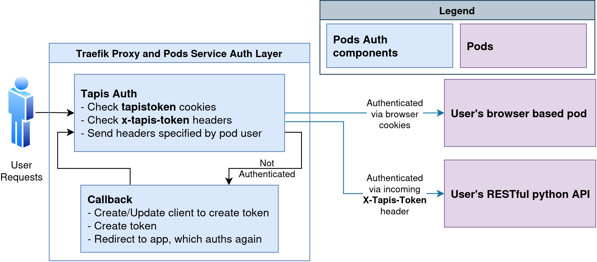

..
    Comment: Heirarchy of headers will now be!
    1: ### over and under
    2: === under
    3: --- under
    4: ^^^ under
    5: ~~~ under

.. _pods:

####
Pods 
####

Introduction to the Pods Service
================================

The Pods Service is a Tapis (TACC API) service which manages Kubernetes pods for a user. The service 
implements a message broker and processor model that requests pods, alongside a health module to poll for pod
data, including logs, status, and health. The service manages networking, certificates, authentication, and routing.
The primary use of this service is to have quick-to-deploy long-lived services based on Docker images that are 
exposed via HTTP or TCP endpoints listed by the API all running in Kubernetes.

The Pods service provides endpoints for managing pods and their constituant components:
    * **Pods** - The base unit of the service, a pod is a Docker container which a user can manage and interact with.
    * **Templates** - A pod template is a pre-configured pod definition that can be recursively referenced by the definition of a pod.
    * **Images** - Endpoints for managing the allowlist of Docker images that can be used in pods.
    * **Volumes** - Volume endpoints are used to manage storage via networked storage solutions.
    * **Snapshots** - Snapshots are used to save the state of a volume at a given time.
    * **Cluster** - *WIP*

Use Cases
---------

The Pods service is designed to be a flexible and powerful tool for deploying and managing containerized services. Pods are meant
to be easy to use with the ability to reference pre-configured templates alongside a UI component in `TapisUI <https://tacc.tapis.io>`.
Some common use cases for the Pods service include:

    * **Web Services** - Quickly deploy a web service from a Docker image.
    * **Databases** - Postgres, Neo4j, MongoDB, MariaDB*.
    * **Machine Learning** - Deploy inference interfaces like Ollama and OpenWebUI with GPUs.
    * **Development** - Develop and test applications in a containerized environment.
    * **Open-Source Tools** - Jupyter, VSCode, Bookstack, Uptime Kuma, and more.
    * **Authenticated Apps** - Tapis OAuth2/OIDC auth can be configure to secure your pods.

The flexible nature of pods means that most containerized applications can be deployed and managed using the Pods service. The
exception to this are generally either applications with unique networking requirements or truly resource intensive applications
(Multi-GPU + High RAM) due to the shared nature of our Kubernetes cluster.

Feedback and Support
--------------------

Please create issues on our `github repo <https://github.com/tapis-project/pods_service>`_ and report problems to the Tapis team.
The service is available to researchers and students. To learn more about the the system, including getting access, follow the
instructions in :doc:`/getting-started/index`.

----

Getting Started
===============

This Getting Started guide will walk you through the initial steps of setting up the necessary accounts and installing
the required software before moving to the Pods Quickstart, where the guide will walk through creating a first pod. If
you are already using Docker Hub and Tapis, feel free to jump right to the `Pods Quickstart`_ or check
out the `Pods Live Docs <https://tapis-project.github.io/live-docs/?service=Pods>`_ for an OpenAPI V3 specification of the API.

Account Creation and Software Installation
------------------------------------------

Create a TACC account
^^^^^^^^^^^^^^^^^^^^^

The main instance of the Pods platform is hosted at the Texas Advanced Computing Center (`TACC <https://tacc.utexas.edu>`_).
TACC designs and deploys some of the world's most powerful advanced computing technologies and innovative software
solutions to enable researchers to answer complex questions. To use the TACC-hosted Pods service, please
create a `TACC account <https://portal.tacc.utexas.edu/account-request>`_.

Create a Docker account
^^^^^^^^^^^^^^^^^^^^^^^

`Docker <https://www.docker.com/>`_ is an open-source container runtime providing operating-system-level
virtualization. The Pods service pulls images for its pods from the public Docker Hub. To register pods
you will need to publish images on Docker Hub, which requires a `Docker account <https://hub.docker.com/>`_ .

Install Tapipy or use cURL
^^^^^^^^^^^^^^^^^^^^^^^^^^^^

To interact with the TACC-hosted Abaco platform in Python, we will leverage the Tapis Python SDK, tapipy. To install it,
simply run:

.. code-block:: bash

    $ pip3 install tapipy

Tapipy provides a simple interface to interact with Tapis services. It provides tab-completion and support for all Tapis services. Read
more about Tapipy :doc:`here <pythondev>` (see `Working with TACC OAuth`_).

This documentation will also walk you through using the Pods service with the `cURL <https://curl.se/>`_ command line tool.
If you will use cURL then make use of this guide :ref:`Tapis Quickstart's cURL example <curl-example>` and continue to the `Pods Quickstart`_.

Working with TACC OAuth
-----------------------

Authentication and authorization to the Tapis APIs uses `OAuth2 <https://oauth.net/2/>`_, a widely-adopted web standard.
Our implementation of OAuth2 is designed to give you the flexibility you need to script and automate use of Tapis
while keeping your access credentials and digital assets secure. This is covered in great detail in our
Tenancy and Authentication section, but some key concepts will be highlighted here, interleaved with Python code.

.. _pods-tapipy-quickstart:

Create an Tapis Client Object
^^^^^^^^^^^^^^^^^^^^^^^^^^^^^

The first step in using the Tapis Python SDK, tapipy, is to create a Tapis Client object. First, import
the ``Tapis`` class and create python object called ``t`` that points to the Tapis server using your TACC
username and password. Do so by typing the following in a Python shell:

.. Important::
   Support for Pods service in Tapipy was added in version 1.2.3.

.. code-block:: python

    # Import the Tapis object
    from tapipy.tapis import Tapis

    # Log into you the Tapis service by providing user/pass and url.
    t = Tapis(base_url='https://tacc.tapis.io',
              username='your username',
              password='your password')

Generate a Token
^^^^^^^^^^^^^^^^

With the ``t`` object instantiated, we can exchange our credentials for an access token. In Tapis, you
never send your username and password directly to the services; instead, you pass an access token which
is cryptographically signed by the OAuth server and includes information about your identity. The Tapis
services use this token to determine who you are and what you can do.

.. code-block:: python

    # Get tokens that will be used for authenticated function calls
    t.get_tokens()
    print(t.access_token.access_token)

    Out[1]: eyJ0eXAiOiJKV1QiLCJhbGciOiJSUzI1NiJ9...

Note that the tapipy ``t`` object will store and pass your access token for you, so you don't have to manually provide
the token when using the tapipy operations. You are now ready to check your access to the Tapis APIs. It will
expire though, after 4 hours, at which time you will need to generate a new token. If you are interested, you
can create an OAuth client (a one-time setup step, like creating a TACC account) that can be used to generate
access and refresh tokens. For simplicity, we are skipping that but if you are interested, check out the Tenancy and
Authentication section.

Check Access to the Tapis APIs
^^^^^^^^^^^^^^^^^^^^^^^^^^^^^^
The tapipy ``t`` object should now be configured to talk to all Tapis APIs on your behalf. We can check that the client is
configured properly by making any API call. For example, we can use the authenticator service to retrieve the full
TACC profile of our user. To do so, use the ``get_profile()`` function associated with the ``authenticator`` object on
the ``t`` object, passing the username of the profile to retrieve, as follows.

.. code-block:: python

    t.authenticator.get_profile(username='apitest')

    Out[1]:
    create_time: None
    dn: cn=apitest,ou=People,dc=tacc,dc=utexas,dc=edu
    email: aci-cic@tacc.utexas.edu
    username: apitest

----

Pods Quickstart
===============

Registering a Pod via Template
------------------------------

To get started we're going to create a Pod via a Template. You can use ``tapipy`` via Python or ``cURL`` via bash to make requests to the Pods service.
It's good to mention that the service is a RESTful API, so you can use any tool that can make HTTP requests.

Authentication is done via an ``X-Tapis-Token`` header, which is an OAuth2 access token, shown in the cURL flow and done in the background by Tapipy.
Authentication is the first step in using Tapis services and is shown in this step.

.. tabs::

    .. group-tab:: Python

        The ``tapipy`` library is TACC's Python SDK for Tapis. The quickstart was `above <pods-tapipy-quickstart>`_. To get started, you'll need 
        to authenticate with Tapis. Here's an additonal example of how to do that:

        .. code-block:: python

            from tapipy.tapis import Tapis

            t = Tapis(
                base_url='https://tacc.tapis.io',
                username='<userid>',
                password='*********'
            )

            # Makes a request using the user/pass to set an access token.
            t.get_tokens()

    .. group-tab:: Bash

        If you are using cURL you should have an access token from the :ref:`Tapis Quickstart's cURL example <curl-example>`.
        Here's an additional example of how to get an access token using cURL:

        .. code-block:: bash

            $ curl -H "Content-type: application/json" \
                   -d '{"username": "your_tacc_username", \
                        "password": "your_tacc_password", \
                        "grant_type": "password" }' \
                   https://tacc.tapis.io/v3/oauth2/tokens

            $ export JWT=your_access_token_string_from_result_above

Once a user has authenticated, they can create a pod. The Pods service uses a templating system to allow users to create pods from pre-configured, versioned, templates.
Users can view templates via TapisUI or the API. The following example shows how to create a pod using the `neo4j` template. Note that fields that a user specifies will
override any existing fields in the template.

.. tabs::

    .. group-tab:: Python

        Using ``tapipy``, we use the ``t.pods.create_pod()`` method and pass the arguments describing
        the pod we want to register through the function parameters.

        .. code-block:: python

            response = t.pods.create_pod(
                pod_id='docpod',
                template='neo4j',
                description='My example pod!'
            )
            print(response)

    .. code-tab:: bash

        curl --request POST \
             --url https://tacc.tapis.io/v3/pods \
             --header 'Content-Type: application/json' \
             --header 'X-Tapis-Token: $JWT' \
             --data '{
                "pod_id": "docpod",
                "template": "neo4j",
                "description": "My example pod!"
             }'

You should receive a response that looks like this.

.. code-block:: bash

    creation_ts: None
    data_attached: []
    data_requests: []
    description: My example pod!
    environment_variables: 

    pod_id: test
    template: template/neo4j
    status: REQUESTED
    status_container: 

    status_requested: ON
    update_ts: None
    url: docpod.pods.tacc.develop.tapis.io

Notes:

- The `pod_id` given will be the id used by you to access the pod at all times. It must be lowercase and alphanumeric.
  It also must be unique within the tenant.
- Pods returned a status of ``REQUESTED`` for the pod; behind the scenes, the Pods service has sent a message requesting
  the pod described to our backend `spawner` infrastructure. The pod's image must be pulled, a pod service must be created
  (for networking), and the networking changes must propagate to the Pod's proxy before the Pod is ready for use.
- When the pod itself has began running, the status will change to ``AVAILABLE``. Networking takes time to propagate (expect <1 minute).
- An ``AVAILABLE`` pod only means the pod itself has started, check pod logs to see what your container is writing to stdout.

At any point we can check the details of our pods, including its status, with the following:

.. tabs::

    .. code-tab:: python

        t.pods.get_pod(pod_id='docpod')
    
    .. code-tab:: bash
        
        curl --request GET \
             --url https://tacc.tapis.io/v3/pods/docpod \
             --header 'Content-Type: application/json' \
             --header 'X-Tapis-Token: $JWT'

The response format is identical to that returned from the ``t.pods.create_pod()`` method.

Accessing a Pod
---------------

Once your pod is in the ``AVAILABLE`` state your pod's specified networking ports should be routed to port 443 at specified urls.
Read more at :ref:`Pod Networking`.

A pod's access urls specified in the pod's `networking` attribute. A pod can have multiple urls, each with different protocols and ports.

Retrieving the Logs
-------------------

The Pods service collects the latest 10 MB of logs from the pod when running and makes them available
via the ``logs`` endpoint. Let's retrieve the logs from the pod we just made. We use the ``get_pod_logs()`` method,
passing in ``pod_id``:

.. code-block:: python

    t.pods.get_pod_logs(pod_id='docpod')

The response should be similar to the following:

.. code-block:: python

    logs:
    Fetching versions.json for Plugin 'apoc' from https://neo4j-contrib.github.io/neo4j-apoc-procedures/versions.json
    Installing Plugin 'apoc' from https://github.com/neo4j-contrib/neo4j-apoc-procedures/releases/download/4.4.0.6/apoc-4.4.0.6-all.jar to /var/lib/neo4j/plugins/apoc.jar 
    Applying default values for plugin apoc to neo4j.conf
    Fetching versions.json for Plugin 'n10s' from https://neo4j-labs.github.io/neosemantics/versions.json
    Installing Plugin 'n10s' from https://github.com/neo4j-labs/neosemantics/releases/download/4.4.0.1/neosemantics-4.4.0.1.jar to /var/lib/neo4j/plugins/n10s.jar 
    Applying default values for plugin n10s to neo4j.conf
    2022-06-16 00:36:14.423+0000 INFO  Starting...
    2022-06-16 00:36:15.602+0000 INFO  This instance is ServerId{eba2fb15} (eba2fb15-713d-47ba-92a5-0a688696264d)
    2022-06-16 00:36:17.468+0000 INFO  ======== Neo4j 4.4.8 ========
    2022-06-16 00:36:21.713+0000 INFO  [system/00000000] successfully initialized: CREATE USER podsservice SET PLAINTEXT PASSWORD 'servicepass' SET PASSWORD CHANGE NOT REQUIRED
    2022-06-16 00:36:21.734+0000 INFO  [system/00000000] successfully initialized: CREATE USER test SET PLAINTEXT PASSWORD 'userpass' SET PASSWORD CHANGE NOT REQUIRED
    2022-06-16 00:36:30.268+0000 INFO  Upgrading security graph to latest version
    2022-06-16 00:36:30.268+0000 INFO  Setting version for 'security-users' to 2
    2022-06-16 00:36:30.270+0000 INFO  Upgrading 'security-users' version property from 2 to 3
    2022-06-16 00:36:30.556+0000 INFO  Called db.clearQueryCaches(): Query caches successfully cleared of 1 queries.
    2022-06-16 00:36:30.667+0000 INFO  Bolt enabled on [0:0:0:0:0:0:0:0%0]:7687.
    2022-06-16 00:36:31.745+0000 INFO  Remote interface available at http://pods-tacc-tacc-docpod:7474/
    2022-06-16 00:36:31.750+0000 INFO  id: B1F0F170083249DAAF9127203310961EF79B262C90EA04D9F08EB7F077DF19E7
    2022-06-16 00:36:31.750+0000 INFO  name: system
    2022-06-16 00:36:31.751+0000 INFO  creationDate: 2022-06-16T00:36:19.073Z
    2022-06-16 00:36:31.751+0000 INFO  Started.

We can see logs from our Neo4j image during the initialization process.

Conclusion
----------

Congratulations! You've now created, registered, and accessed your first pod. There is a lot more you can do with
the Pods service though. To learn more about the additional capabilities, please continue on to the Technical Guide.

----

Interacting with Pods
==========

Managing Pod Definitions and Customizing Pod Behavior
----------------------------------------------------

Before interacting with your pod (e.g., retrieving logs), it's important to understand how to control the behavior of your container using the pod definition fields: ``command``, ``arguments``, and ``environment_variables``. These fields allow you to customize how your container runs, override default entrypoints, and inject configuration or secrets.

**Entrypoint and Command Customization**

Every Docker image has a default entrypoint and command, which determines what runs when the container starts. You can inspect these defaults using:

.. code-block:: bash

    docker inspect <image> | grep -i entrypoint

If you want to override the entrypoint (for example, to run a shell before the default script), you can use the ``command`` field. For example, to run a shell and then the default entrypoint, you might use:

.. code-block:: yaml

    command: ["bash", "-c", "echo 'Debugging...' && ./docker-entrypoint.sh"]

You can also use ``arguments`` to pass additional parameters to your command.

**Using Environment Variables**

The ``environment_variables`` field is the most flexible way to modify the behavior of your image. Many images support configuration via environment variables (e.g., setting ports, enabling features, or providing credentials).

You can also pass through certain secrets using special placeholders. For example, you can use ``<<tapissecret_user_username>>`` or ``<<tapissecret_user_password>>`` in your environment variables, and these will be replaced with the appropriate values at pod creation time. This allows you to securely inject user or service credentials into your container.

.. note::
   Currently, only ``user_username``, ``user_password``, ``service_username``, and ``service_password`` are supported as secrets. Support for ``tapisusername``, ``tapistenant``, and ``tapissite`` will be added in the future, currently those are only available to response_headers.

**Debugging, Custom Startup, and Best Practices**

You can use the pod definition fields to customize startup behavior and debug your pod. For example, you might set the command to sleep for a long time or print environment variables before starting your application. This is useful for troubleshooting configuration issues or ensuring your environment is set up as expected.

**Best Practices:**

- Use ``environment_variables`` to enable or configure features in your image.
- Use ``command`` and ``arguments`` to override the default startup behavior, especially for debugging or custom workflows.
- Use secret placeholders to securely inject credentials.
- For debugging, you can set the command to ``["sleep", "5000"]`` or print environment variables before starting your main process.

**Example of setting Pod to sleep for debugging**

.. tabs::

    .. group-tab:: Python

        .. code-block:: python

            t.pods.create_pod(
                pod_id='debugpod',
                image='myimage:latest',
                command=['bash', '-c', 'echo "Starting debug..." && sleep 5000 && ./docker-entrypoint.sh'],
                arguments=[],
                environment_variables={
                    'MY_FEATURE_FLAG': 'true',
                    'DB_USER': '<<tapissecret_user_username>>',
                    'DB_PASS': '<<tapissecret_user_password>>'
                }
            )

    .. group-tab:: Bash

        .. code-block:: bash

            curl --request POST \
                 --url https://tacc.tapis.io/v3/pods \
                 --header 'Content-Type: application/json' \
                 --header 'X-Tapis-Token: $JWT' \
                 --data '{
                    "pod_id": "debugpod",
                    "image": "myimage:latest",
                    "command": ["bash", "-c", "echo \"Starting debug...\" && sleep 5000 && ./docker-entrypoint.sh"],
                    "arguments": [],
                    "environment_variables": {
                        "MY_FEATURE_FLAG": "true",
                        "DB_USER": "<<tapissecret_user_username>>",
                        "DB_PASS": "<<tapissecret_user_password>>"
                    }
                 }'

Logs
----

Logs are an essential tool for debugging errors in your code, monitoring the progress of your application, or diagnosing issues with your pod. The Pods service provides access to stdout and stderr logs from the container, making it easy to see what your application is doing in real-time.
Logs are only relevant for ``AVAILABLE`` pods. If the pod has already ran, then logs will remain until next pod start. Only once a new pod starts will the logs be cleared and updated.

**Retrieving stdout and stderr logs**

You can retrieve the latest logs from your pod using the following methods:

.. tabs::

    .. group-tab:: Python

        .. code-block:: python

            logs = t.pods.get_pod_logs(pod_id='mypod')
            print(logs['logs'])

    .. group-tab:: Bash

        .. code-block:: bash

            curl --request GET \
                 --url https://tacc.tapis.io/v3/pods/mypod/logs \
                 --header 'X-Tapis-Token: $JWT'

    .. group-tab:: TapisUI

        To view logs in TapisUI, navigate to the "Pods" page, select your pod, and click on the ``Logs`` tab. This will display the same logs as the API.

        .. image:: images/tapisui-pods-logs.png
          :width: 100%
          :align: center
          :alt: TapisUI page for Pods logs

Action Logs
--------

Action logs provide a history of changes to your pod, such as health status updates, user modifications, or state changes. While not a full audit log, action logs can help you understand what has happened to your pod over time and identify potential issues. For example, you can see when a pod was started, stopped, or updated, and by whom.

Retrieving action logs
^^^^^^^^^^^^^^^^^^^^^^^

You can retrieve action logs using the following methods:

.. tabs::

    .. group-tab:: Python

        .. code-block:: python

            logs = t.pods.get_pod_logs(pod_id='mypod')
            print(logs['action_logs'])

    .. group-tab:: Bash

        .. code-block:: bash

            curl --request GET \
                 --url https://tacc.tapis.io/v3/pods/mypod/logs \
                 --header 'X-Tapis-Token: $JWT'

    .. group-tab:: TapisUI

        To view action logs in TapisUI, navigate to the "Pods" page, select your pod, and click on the ``Action Logs`` tab. This will display the same logs as the API.
        
        .. image:: images/tapisui-pods-actionlogs.png
          :width: 100%
          :align: center
          :alt: TapisUI page for Pods action logs

Storage Interactions
--------------------

The Pods service supports multiple methods for managing files and data:

- **upload_to_pod**: For quick, temporary file uploads directly to a pod. Files are not persistent and will be lost on pod restarts.
- **Volumes**: For declarative, persistent storage that can be shared across pods.
- **Snapshots**: For creating backups of volumes or sharing read-only files.

Uploading Files to a Pod
^^^^^^^^^^^^^^^^^^^^^^^^^^^^^^^^^^^^^^^

The `upload_to_pod` endpoint allows you to quickly upload files directly to a pod. This is useful for temporary files or quick data transfers. Note that files uploaded this way are not persistent and will be lost if the pod is restarted. Additionally, large files (up to 3GB) may take up to 15 minutes to upload.

No additional setup is required to use `upload_to_pod`. Simply specify the destination path within the pod and upload your file.

.. tabs::

    .. group-tab:: Python

        .. code-block:: python

            with open('/path/to/local/file.sql', 'rb') as file:
                response = t.pods.upload_to_pod(
                    pod_id='mypod',
                    file=file,
                    dest_path='/path/in/pod/file.sql'
                )

    .. group-tab:: Bash

        .. code-block:: bash

            curl --request POST \
                 --url https://tacc.tapis.io/v3/pods/mypod/upload_to_pod \
                 --header 'X-Tapis-Token: $JWT' \
                 --form file=@/path/to/local/file.sql \
                 --form dest_path='/path/in/pod/file.sql'

Volumes
^^^^^^^^^^

Volumes provide persistent storage that can be shared across multiple pods. To use a volume, you must first create it using the `create_volume` API or TapisUI. This adds a layer of setup compared to `upload_to_pod`, but it ensures that your data is persistent and accessible even if the pod is restarted.

Here's how to create a volume, mount it to a pod, upload files, and list files in the volume:

.. tabs::

    .. group-tab:: Python

        .. code-block:: python

            # Create a volume
            t.pods.create_volume(
                volume_id='myvolume',
                description='My persistent volume',
                size_limit=1024
            )

            # Attach the volume to a pod on pod creation (can also update existing pods)
            t.pods.create_pod(
                pod_id='mypod',
                volume_mounts={
                  "myvolume": {
                    "type": "tapisvolume",
                    "mount_path": "/mnt/data",
                    "volume_id": "myvolume"
                  }
                }
            )

            # List files in the volume
            files = t.pods.list_volume_files(volume_id='myvolume')
            print(files)

            # Upload a file to the volume
            with open('/path/to/local/file.sql', 'rb') as file:
                t.pods.upload_to_volume(
                    volume_id='myvolume',
                    path='/data/file.sql',
                    file=file
                )

            # Get contents of a file or directory (as zip, set zip=True)
            contents = t.pods.get_volume_contents(volume_id='myvolume', path='/data', zip=False)
            print(contents)

    .. group-tab:: Bash

        .. code-block:: bash

            # Create a volume
            curl --request POST \
                 --url https://tacc.tapis.io/v3/volumes \
                 --header 'Content-Type: application/json' \
                 --header 'X-Tapis-Token: $JWT' \
                 --data '{"volume_id": "myvolume", "description": "My persistent volume", "size_limit": 1024}'

            # Attach the volume to a pod on pod creation (can also update existing pods)
            curl --request POST \
                 --url https://tacc.tapis.io/v3/pods/mypod/volumes \
                 --header 'Content-Type: application/json' \
                 --header 'X-Tapis-Token: $JWT' \
                 --data '{"volume_mounts": {"myvolume": {"type": "tapisvolume", "mount_path": "/mnt/data", "volume_id": "myvolume"}}}'

            # List files in the volume
            curl --request GET \
                 --url https://tacc.tapis.io/v3/volumes/myvolume/files \
                 --header 'X-Tapis-Token: $JWT'

            # Upload a file to the volume
            curl --request POST \
                 --url https://tacc.tapis.io/v3/volumes/myvolume/files/data/file.sql \
                 --header 'X-Tapis-Token: $JWT' \
                 --form file=@/path/to/local/file.sql

            # Get contents of a file or directory
            curl --request GET \
                 --url https://tacc.tapis.io/v3/volumes/myvolume/files/data \
                 --header 'X-Tapis-Token: $JWT'

    .. group-tab:: TapisUI

        To create a volume in TapisUI, navigate to the "Volumes" page and click on the "Create Volume" button. Fill in the required details such as volume ID, description, and size limit, and submit the form.

        To list files in a volume, navigate to the "Volumes" page, select the desired volume, and click on the "Files" tab. This will display the files stored in the volume.

Snapshots
^^^^^^^^^^^^

Snapshots are read-only copies of a volume at a specific point in time. They are useful for creating backups or preserving the state of your data for later use. Snapshots can also be mounted if you need to access the data.

To create a snapshot, you must specify the source volume and path. Snapshots can also include a description, size limit, and optional cron or retention policies.

.. tabs::

    .. group-tab:: Python

        .. code-block:: python

            # Create a snapshot
            t.pods.create_snapshot(
                snapshot_id='mysnapshot',
                source_volume_id='myvolume',
                source_volume_path='/data',
                description='Backup of my data'
            )

            # List files in the snapshot
            files = t.pods.list_snapshot_files(snapshot_id='mysnapshot')
            print(files)

            # Get contents of a file or directory
            contents = t.pods.get_snapshot_contents(snapshot_id='mysnapshot', path='/data')
            print(contents)

    .. group-tab:: Bash

        .. code-block:: bash

            # Create a snapshot
            curl --request POST \
                 --url https://tacc.tapis.io/v3/snapshots \
                 --header 'Content-Type: application/json' \
                 --header 'X-Tapis-Token: $JWT' \
                 --data '{"snapshot_id": "mysnapshot", "source_volume_id": "myvolume", "source_volume_path": "/data", "description": "Backup of my data"}'

            # List files in the snapshot
            curl --request GET \
                 --url https://tacc.tapis.io/v3/snapshots/mysnapshot/files \
                 --header 'X-Tapis-Token: $JWT'

            # Get contents of a file or directory
            curl --request GET \
                 --url https://tacc.tapis.io/v3/snapshots/mysnapshot/files/data \
                 --header 'X-Tapis-Token: $JWT'

    .. group-tab:: TapisUI

        To create a snapshot in TapisUI, navigate to the "Snapshots" page and click on the "Create Snapshot" button. Fill in the required details such as snapshot ID, source volume, and source path, and submit the form.

        To list files in a snapshot, navigate to the "Snapshots" page, select the desired snapshot, and click on the "Files" tab. This will display the files stored in the snapshot.

Pod Executions
--------------

The Pods service provides the `exec_pod_commands` endpoint, allowing you to execute one or more commands inside your running pod. This is especially useful for debugging, running shell commands like `ls`, or performing complex operations such as loading data into a database.

You can execute either a single command (``["sleep", "5"]``) or multiple commands (``[["sleep", "5"], ["echo", "hello"]]``). Commands are run sequentially, and the request remains open until all commands complete. The response includes the output, success/failure status, and execution duration for each command.

This feature is ideal for:
- Debugging your application by running shell commands
- Inspecting files and directories inside the pod
- Running database import/export operations
- Automating setup or maintenance tasks

**Request Parameters**

- `pod_id` (required): The ID of the pod to execute commands in
- `commands` (required): List of commands to run. Each command can be a string or a list of strings (arguments)
- `total_timeout` (optional): Total time (in seconds) to wait for all commands to finish. Default: 300
- `command_timeout` (optional): Time (in seconds) to wait for each command to finish. Default: 60
- `fail_on_non_success` (optional): If true, the request fails if any command does not return 0. Default: true

**Example Use Case: Loading a MySQL Dump**

Suppose you have a MySQL pod and want to load a database dump. You can use `upload_to_pod` to upload your SQL file to the pod. For persistence, you could use a volume, but for quick, temporary loads, uploading directly is often sufficient. If the pod restarts, simply re-upload the file as needed.

Here is how you can upload a file and then load it into MySQL using pod executions:

.. tabs::

    .. group-tab:: Python

        .. code-block:: python

            # Upload the SQL file (temporary, not persistent)
            with open('/path/to/local/file.sql', 'rb') as file:
                t.pods.upload_to_pod(
                    pod_id='mysqlpod',
                    file=file,
                    dest_path='/tmp/file.sql'
                )

            # Execute commands: list files, then load SQL dump
            response = t.pods.exec_pod_commands(
                pod_id='mysqlpod',
                commands=[
                    ['ls', '-lah', '/tmp'],
                    ['/bin/bash', '-c', 'mysql -u root -p<password> < /tmp/file.sql']
                ],
                command_timeout=3600,
                total_timeout=3600,
                fail_on_non_success=true
            )
            print(response)

    .. group-tab:: Bash

        .. code-block:: bash

            # Upload the SQL file
            curl --request POST \
                 --url https://tacc.tapis.io/v3/pods/mysqlpod/upload_to_pod \
                 --header 'X-Tapis-Token: $JWT' \
                 --form file=@/path/to/local/file.sql \
                 --form dest_path=/tmp/file.sql

            # Execute commands: list files, then load SQL dump
            curl --request POST \
                 --url https://tacc.tapis.io/v3/pods/mysqlpod/exec \
                 --header 'X-Tapis-Token: $JWT' \
                 --header 'Content-Type: application/json' \
                 --data '{
                     "commands": [
                         ["ls", "-lah", "/tmp"],
                         ["/bin/bash", "-c", "mysql -u root -p<password> < /tmp/file.sql"]
                     ],
                     "command_timeout": 3600,
                     "total_timeout": 3600,
                     "fail_on_non_success": true
                 }'

    .. group-tab:: TapisUI

        There's currently no TapisUI support for executing commands in pods. TapisUI support is planned for a future release.

The consolidated response will include the output and status for each command, making it easy to verify success or debug issues.

Managing Pod Permissions
-----------------------

The Pods service provides a permissions model that allows pod owners to share access with other Tapis users. Permissions can be granted at different levels, controlling what actions other users can perform on a pod.

Permission levels in the Pods service are hierarchical. If a user has ADMIN permission, they also have USER and READ permissions. If a user has USER permission, they also have READ permission. The following table lists the available permission levels and their descriptions:

.. list-table::
    :header-rows: 1
    :widths: 20 80

    * - Level
      - Description
    * - ADMIN
      - Full control over the pod, including stopping, starting, and deleting
    * - USER
      - Can update pod, view credentials, and access permissions list
    * - READ
      - Can view pod details and logs but cannot modify the pod

.. warning::
    Even READ permission provides significant access to a pod. Users with READ permission can view logs, which may contain sensitive information such as connection strings, passwords, or user data depending on what the container writes to stdout/stderr. Have an idea on finer permission granularity? Let us know with a Github issue, we're improved by you!

This table list the available endpoints and the permission that a user must have to access them:

.. list-table::
    :header-rows: 1
    :widths: 40 15 13

    * - Endpoint
      - Method
      - Required Permission
    * - /pods/{pod_id}/permissions
      - GET
      - USER
    * - /pods/{pod_id}/permissions/{user}
      - DELETE
      - ADMIN
    * - /pods/{pod_id}/permissions
      - POST
      - ADMIN
    * - /pods/{pod_id}/logs
      - GET
      - READ
    * - /pods/{pod_id}/credentials
      - GET
      - USER
    * - /pods/{pod_id}/save_pod_as_template_tag
      - POST
      - ADMIN
    * - /pods/{pod_id}/stop
      - GET
      - ADMIN
    * - /pods/{pod_id}/start
      - GET
      - ADMIN
    * - /pods/{pod_id}/restart
      - GET
      - ADMIN
    * - /pods/{pod_id}/derived
      - GET
      - READ
    * - /pods/{pod_id}/exec
      - POST
      - ADMIN
    * - /pods/{pod_id}
      - GET
      - READ
    * - /pods/{pod_id}
      - PUT
      - USER
    * - /pods/{pod_id}
      - DELETE
      - ADMIN
    * - /pods
      - GET
      - NONE
    * - /pods
      - POST
      - NONE

Adding and Managing Permissions
^^^^^^^^^^^^^^^^^^^^^^^^^^^^^^

The pod owner can add other users with specific permission levels using the following formats: 
``username:ADMIN``, ``username:USER``, or ``username:READ``.

Here are examples of how to manage pod permissions:

.. tabs::

    .. group-tab:: Python

        **Adding a user with permission**

        .. code-block:: python

            # Add user 'superuser' with ADMIN permission to pod 'docmost'
            t.pods.set_pod_permission(
                    pod_id='docmost',
                    user='superuser',
                    level='ADMIN'
            )

        **Listing all users with pod permissions**

        .. code-block:: python

            # Get all permissions for pod 'docmost'
            permissions = t.pods.get_pod_permissions(pod_id='docmost')
            print(permissions)
            
            # Response
            [
                "superuser:ADMIN",
                "originaluser:ADMIN"
            ]

        **Removing a user's permission**

        .. code-block:: python

            # Remove permissions for user 'superuser' from pod 'docmost'
            t.pods.delete_pod_permission(
                    pod_id='docmost',
                    user='superuser'
            )

    .. group-tab:: Bash

        **Adding a user with permission**

        .. code-block:: bash

            curl --request POST \
                 --url https://tacc.tapis.io/v3/pods/docmost/permissions \
                 --header 'Content-Type: application/json' \
                 --header 'X-Tapis-Token: $JWT' \
                 --data '{ 
                     "user": "superuser", 
                     "level": "ADMIN" 
                 }'

        **Listing all users with pod permissions**

        .. code-block:: bash

            curl --request GET \
                    --url https://tacc.tapis.io/v3/pods/docmost/permissions \
                    --header 'Content-Type: application/json' \
                    --header 'X-Tapis-Token: $JWT'

            # Response
            {
                "message": "Pod permissions retrieved successfully.",
                "metadata": {},
                "result": {
                    "permissions": [
                        "superuser:ADMIN",
                        "originaluser:ADMIN"
                    ]
                },
                "status": "success",
                "version": "1.X.X"
            }

        **Removing a user's permission**

        .. code-block:: bash

            curl --request DELETE \
                    --url https://tacc.tapis.io/v3/pods/docmost/permissions/superuser \
                    --header 'Content-Type: application/json' \
                    --header 'X-Tapis-Token: $JWT'

    .. group-tab:: TapisUI

        To add a user with permission, navigate to the "Pods" page, select your pod, and click on the ``Perms`` tab. From there you have a list of users and can add users with the ``+`` button. Support for removing not yet implemented via UI.

        .. image:: images/tapisui-pods-permissions.png
          :width: 100%
          :align: center
          :alt: TapisUI adding permissions to pods

Pod Networking
----------------

The Pods service manages networking for your containers through a Traefik proxy, automatically handling routing and domain configuration. Each pod gets a subdomain on the Tapis service domain (e.g. ``mypod.pods.tacc.tapis.io``), making it accessible through HTTPS without requiring any manual network configuration. The networking configuration allows you to control how your pods are accessed, including protocol selection, port definition, authentication, and access restrictions when using authentication.

When a pod is created, the service configures networking based on the provided settings. For example, in the Neo4j quickstart example, the service automatically configured a TCP port for the Neo4j Bolt protocol and an HTTP port for the Neo4j Browser interface.

Networking Configuration Options
^^^^^^^^^^^^^^^^^^^^^^^^^^^^^^^^

The following table describes the key fields available for configuring networking for your pods:

.. list-table::
    :header-rows: 1
    :widths: 24 76

    * - Field
      - Description
    * - protocol
      - Specifies the network protocol to use. Options include ``http``, ``tcp``, ``postgres``, or ``local_only``. The ``local_only`` option makes the pod accessible only from within the cluster. Default: ``http``.
    * - port
      - The container port to expose via the URL in this networking object. Default: ``5000``.
    * - url
      - URL used to access the pod. This is automatically generated by the service in the format ``<pod_id>.pods.<service_domain>``. ``mypod.pods.tacc.tapis.io`` for example.
    * - ip_allow_list
      - List of IP addresses/ranges that are allowed to access this specific pod port. If empty, all IPs are allowed. Example: ``['127.0.0.1/32', '192.168.1.7']``.

The following example shows a basic networking configuration for a pod which exposes port 8080 via HTTP (all Pods traffic makes use of HTTPS) to ``<pod_id>.pods.<service_domain>``:

.. code-block:: json

    "networking": {
      "default": {
        "protocol": "http",
        "port": 8080
      }
    }

For database pods like PostgreSQL or Neo4j, specific protocols and configurations are recommended:

.. tabs::

    .. tab:: Neo4j

        .. code-block:: json

            "networking": {
              "bolt": {
                "protocol": "tcp",
                "port": 7687
              },
              "default": {
                "protocol": "http",
                "port": 7474
              }
            }
        
        This configuration would proxy Neo4j's Bolt protocol to ``mypod-bolt.pods.tacc.tapis.io`` and the Browser interface to ``mypod.pods.tacc.tapis.io``.

    .. tab:: PostgreSQL

        .. code-block:: json

            "networking": {
              "postgres": {
                "protocol": "postgres",
                "port": 5432
              }
            }

        This would proxy Postgres's 5432 port to mypod-postgres.pods.tacc.tapis.io. By not specifying ``default`` for the networking key we can allocate another interface on the "main subdomain".

Tapis Authentication
^^^^^^^^^^^^^^^^^^^^

The Pods service supports securing pods with Tapis authentication, allowing only authorized users access. When enabled, users are redirected to authenticate with Tapis before being sent back to the pod. This feature secures applications requiring authentication. Tenant authentication rules are enforced per-tenant, with additional configuration options available to manage access control via Pods. This is implemented via the Traefik forwardAuth middleware.

.. important::
    ``tapis_auth`` is a new feature and is definitely not foolproof. It may have limitations or unexpected behaviors in certain scenarios. Users should test thoroughly before relying on this authentication mechanism for sensitive applications. Please report any issues via github issues.

.. warning::
    ``tapis_auth`` is one of many Tapis authentication methods. It does not provide token to user applications. But be aware that other Tapis authentication methods might pass along more information. Tapis supports full OIDC support via the Tapis Authenticator API.

.. list-table::
    :header-rows: 1
    :widths: 24 76

    * - Field
      - Description
    * - tapis_auth
      - Boolean flag that enables or disables Tapis authentication for the pod. Default: ``false``.
    * - tapis_auth_response_headers
      - Specifies which headers from the authentication should be passed to the pod. Useful for passing identity information to the container. ``<<tapisusername>>``, ``<<tapistenantid>>``, and ``<<tapissiteid>>`` replace values in header values. Example: passing ``incominguser: <<tapisusername>>`` to provide user information to application.
    * - tapis_auth_allowed_users
      - List of users allowed to access the pod. If set to ``["*"]`` or not specified, all authenticated Tapis users in the tenant can access it. Be aware that some tenant restrictions are quite lenient if not explicitly hardened.
    * - tapis_auth_return_path
      - Path to redirect to after successful initial authentication. Default: ``/``.
    * - cors_allow_origins
      - List of allowed origins for CORS requests. Only requests from these origins will be accepted. Example: ``['https://tacc.develop.tapis.io', 'https://tacc.tapis.io']``
    * - cors_allow_methods
      - List of HTTP methods allowed for CORS requests. Example: ``['GET', 'POST', 'PUT', 'DELETE', 'OPTIONS', 'HEAD', 'PATCH']``
    * - cors_allow_headers
      - List of HTTP headers allowed in CORS requests. Commonly includes ``'content-type'``, ``'x-tapis-token'``, and any custom headers your application needs. Example: ``['content-type', 'x-tapis-token', 'TAPIS-VALIDATED-USERNAME']``
    * - cors_allow_credentials
      - Boolean to allow credentials (such as cookies or HTTP authentication) to be sent with CORS requests. Default: ``false``.
    * - cors_max_age
      - Maximum age (in seconds) for which the results of a preflight request can be cached by the browser. Default: ``100`` seconds.
    * - cors_add_vary_header
      - **Not Implemented** - If you need this feature, please contact support to discuss your use case. Default is ``false``.

.. note::
      
    Flask drops response headers with underscores. Thus ``tapis_auth_response_headers`` headers with underscores will likely be dropped in Flask applications. This is a legacy restriction/issue tied to WSGI and the CGI specification. Hyphens are preferred in Flask.

Example of a pod with Tapis authentication enabled:

.. code-block:: python

    "networking": {
      "default": {
        "protocol": "http",
        "port": 8080,
        "tapis_auth": true,
        "tapis_auth_response_headers": {
          "X-Tapis-Username": "<<tapisusername>>",
          "X-Tapis-Tenant": "<<tapistenantid>>",
          "X-Tapis-Site": "<<tapissiteid>>",
          "Flask-does-not-accept-underscores-in-headers": "tip#1",
          "pods_service_still_accepts-underscores-in-headers_though": "tip#2"
          "Random-Header-Which-User-Might-Set": "nottip#3"
          # true email support changes per tenant, contact us to discuss
          "Lot-Of-Apps-Expect-Email-This-Works-For-Some": "<<tapisusername>>@domain.io",
          "Internal": "<<tapisusername>>.<<tapistenantid>>.<<tapissiteid>>",
        },
        "tapis_auth_allowed_users": ["superuser", "originaluser"]
      }
    }

In this example, only users ``superuser`` and ``originaluser`` can access the pod, and their Tapis username/tenant/site will be passed to the application via HTTP headers.

Accessing a Pod with Tapis Auth via Browser
~~~~~~~~~~~~~~~~~~~~~~~~~~~~~~~~~~~~~~~~~~~~~

Tapis Auth intercepts calls to user pods in the browser. Only once authenticated will a user be able to access ``http`` ports from a pod. The flow is as follows:

1. User accesses the pod URL (e.g., ``https://mypod.pods.tacc.tapis.io``).
2. The Pods service checks if Tapis authentication is enabled.
3. If enabled, the user session cookies are checked for "X-Tapis-Token".
4. If the token is not present, the user is redirected to Tapis for authentication.
5. After successful authentication, the user is redirected back to the pod URL.
6. The Pods service checks the token and, if valid, allows access to the pod.
7. The user can now interact with the pod as intended.

Accessing a Pod with Tapis Auth via Code
~~~~~~~~~~~~~~~~~~~~~~~~~~~~~~~~~~~~~~~~~~

Tapis Auth allows access to users pods via header auth via an ``X-Tapis-Token`` header. This allows access to user APIs or services via non-browser based flows.
For instance if you had an Open WebUI pod which requires JWT auth with Tapis Auth enabled you'll need to provide two headers.

.. code-block:: bash

  curl --request GET \
  --url https://openwebui.pods.tacc.tapis.io/ollama/api/tags \
  --header 'Authorization: Bearer <<JWT-FROM-CONTAINER-GUI>>' \
  --header 'X-Tapis-Token: <<pass tapis jwt>>'

Above is a dual auth example. For example, if the pod doesn't implement it's own auth a user would only need to provide something like the following to list api endpoints on a flask server.

.. code-block:: bash
  
  curl --request GET \
  --url https://fastapi.pods.tacc.tapis.io/endpoints/list \
  --header 'X-Tapis-Token: <<pass tapis jwt>>'

It's important to note that currently if a user attempts authentication with headers they must specify ``X-Tapis-Token``. If a request doesn't contain the header they'll be redirected to webflow with no error message, which will break in code or CLI. If the header is non-valid a proper error response will be returned.

Diagram of Tapis Auth logic
~~~~~~~~~~~~~~~~~~~~~~~~~~~

Here's a diagram showing the flow a user's request would take to get to their pods. Essentially all requests are intercepted and validated before moving forward.

Explanation of CORS and Tapis Auth interactions
~~~~~~~~~~~~~~~~~~~~~~~~~~~~
.. list-table::
   :header-rows: 1
   :widths: 24 76

   * - Field
     - Description
   * - ``cors_allow_origins``
     - Controls which remote domains (origins) are allowed to make requests to your pod. For example, setting this to your frontend's URL allows your web app to call your pod's API.
   * - ``cors_allow_methods``
     - Specifies which HTTP methods (GET, POST, etc.) are permitted in cross-origin requests. This should include all methods your application expects to handle.
   * - ``cors_allow_headers``
     - Lists which headers can be sent in CORS requests. At a minimum, you usually need ``content-type`` for POST/PUT requests, and any custom headers (like ``x-tapis-token``) your app or authentication requires.
   * - ``cors_allow_credentials``
     - If set to true, browsers are allowed to send credentials (like cookies or HTTP auth) with requests. Default is false for security.
   * - ``cors_max_age``
     - Sets how long (in seconds) browsers can cache the CORS preflight response. Default is 100 seconds, which reduces the number of preflight requests but can be adjusted as needed.
   * - ``cors_add_vary_header``
     - **Not Implemented** - If you need this feature, please contact support to discuss your use case. It is always set as ``false``. The setting is useful for caching proxies to understand that the response varies based on the origin of the request.

.. note::
      
    When Tapis Auth is used CORS must be set via the pod networking configuration. This is because Tapis Auth relies on a forwardAuth middleware for auth handling. This layer is not aware of the pod's CORS settings and will pass nothing along for the client app to negotiate CORS with. If Tapis Auth is not used then users can set CORS via Pods or through client application such as Flask or FastAPI as CORS negotiations are routed to the application to handle.

**Example CORS Configuration in Pod Networking:**

This is a simple example of how to configure CORS in your pod's networking settings. This configuration allows requests from specific origins, supports various HTTP methods, and includes custom headers for authentication which the user service can utilize.

Generally the aim is to minimize the number of origins and methods to only those that are necessary for your application. This reduces the attack surface and improves security. The example below could be good for debugging but should likely be tightened up for production use.

.. code-block:: json

    "networking": {
      "default": {
        "protocol": "http",
        "port": 8080,
        "cors_allow_origins": [
          "https://myfrontend.pods.tacc.tapis.io",
          "https://myfrontendauthtest.pods.tacc.tapis.io",
          "https://myfrontendstaging.pods.tacc.tapis.io"
        ],
        "cors_allow_methods": [
          "GET", "POST", "OPTIONS", "DELETE", "PUT", "HEAD", "PATCH"
        ],
        "cors_allow_headers": [
          "content-type", "x-tapis-token", "TAPIS-VALIDATED-USERNAME"
        ],
        "cors_allow_credentials": false,
        "cors_max_age": 100
      }
    }

**Traefik Middleware Attachment**

When you configure CORS in your pod's networking, the Pods service automatically creates a Traefik middleware with your settings and applies it to your pod. For example, the following Traefik middleware would be generated for the above configuration:

.. code-block:: yaml

    tapis-cors-pods-tacc-tacc-myfrontend:
      headers:
        accessControlAllowOriginList:
          - "https://myfrontend.pods.tacc.tapis.io"
          - "https://myfrontendauthtest.pods.tacc.tapis.io"
          - "https://myfrontendstaging.pods.tacc.tapis.io"
        accessControlAllowMethods:
          - "GET"
          - "POST"
          - "OPTIONS"
          - "DELETE"
          - "PUT"
          - "HEAD"
          - "PATCH"
        accessControlAllowHeaders:
          - "content-type"
          - "x-tapis-token"
          - "TAPIS-VALIDATED-USERNAME"
        accessControlAllowCredentials: false
        accessControlMaxAge: 100
        addVaryHeader: true

This middleware is attached to your pod's subdomain, ensuring that CORS requests are handled according to your configuration.

TapisUI Integration
^^^^^^^^^^^^^^^^^^

The Pods service includes features specifically designed to improve integration with the TapisUI web interface. These are a few helpful options.

.. warning::
    TapisUI integration features are currently a work in progress (WIP) and may not be fully functional. These features are under active development and subject to change without notice. Users should test thoroughly before relying on these features in production environments.

.. list-table::
    :header-rows: 1
    :widths: 24 76

    * - Field
      - Description
    * - tapis_ui_uri
      - A URL path for the TapisUI to use when providing a link to this pod. Default: empty string.
    * - tapis_ui_uri_redirect
      - If ``true``, automatically redirects to the ``tapis_ui_uri`` when accessing the pod through TapisUI. If ``false``, the URL is displayed as read-only. Default: ``false``.
    * - tapis_ui_uri_description
      - A description of where the ``tapis_ui_uri`` will redirect, shown in the UI. Default: empty string.

Example of TapisUI integration configuration:

.. code-block:: json

    "networking": {
      "default": {
        "protocol": "http",
        "port": 8080,
        "tapis_ui_uri": "/admin",
        "tapis_ui_uri_redirect": true,
        "tapis_ui_uri_description": "Admin dashboard for monitoring pod metrics"
      }
    }

This will configure the TapisUI ``link`` button to redirect to the specified ``/admin`` route of the pod url (rather than ``/``), with a helpful description explaining where the link leads.

Templates
=================

Tapis Pods supports templating, which allows users to create reusable pod definitions. Users make use of templates and their underlying template tags to define a pod.

Templates
---------
Templates are essentially groups of template tags that are shareable, providing users with access to any associated tag within the template.
Templates facilitate the organization and sharing of pod configurations, allowing users to leverage predefined setups. The only way to currently share pod
configurations is through templates, making them a crucial component for collaborative and consistent deployment practices.

.. list-table::
    :header-rows: 1
    :widths: 24 76

    * - Field
      - Description
    * - template_id
      - **Required**. Name of the template. Type: string.
    * - description
      - Description of the template. Type: string. Default: "".
    * - metatags
      - Metadata tags for additional search/listing functionality for the template. Type: array of strings. Default: [].
    * - archive_message
      - If set, metadata message to give users of this template. Type: string. Default: "".
    * - creation_ts
      - Time (UTC) that this template was created. Type: string <date-time>.
    * - update_ts
      - Time (UTC) that this template was updated. Type: string <date-time>.
    * - tenant_id
      - Tapis tenant used during creation of this template. Type: string. Default: "".
    * - site_id
      - Tapis site used during creation of this template. Type: string. Default: "".
    * - permissions
      - Template permissions in user:level format. Type: array of strings. Default: [].

.. tabs::

    .. group-tab:: Python

        To list available templates, use the following command:

        .. code-block:: python

            templates = t.pods.list_templates()
            print(templates)

        To create a template in Tapis Pods, use the ``tapipy`` and the ``t.pods.add_template()`` function:

        .. code-block:: python

            t.pods.add_template(
                template_id='mongo',
                description="TACC's MongoDB template",
                metatags=['mongo', 'database', 'TACC', 'http']
            )

    .. group-tab:: Bash

        To list available templates, use the following command:

        .. code-block:: bash

            curl --request GET \
                --url https://tacc.tapis.io/v3/pods/templates \
                --header 'Content-Type: application/json' \
                --header 'X-Tapis-Token: $JWT'

        To create a template in Tapis Pods, use the corresponding ``curl`` request:

        .. code-block:: bash

            curl --request POST \
                --url https://tacc.tapis.io/v3/pods/templates \
                --header 'Content-Type: application/json' \
                --header 'X-Tapis-Token: $JWT' \
                --data '{  
                    "template_id": "mongo",  
                    "description": "TACC's MongoDB template",  
                    "metatags": [ "mongo", "database", "TACC", "http" ]  
                }'

Template Tags
-----------------------
Template tags are the underlying definitions within a template, each marked with a ``tag_timestamp`` and immutable once created.
These tags specify the pod configurations and can be overridden with user-defined values at runtime. Template tags can also reference
other template tags, enabling a recursive definition of pod configurations. This flexibility allows users to save and share complex pod setups efficiently.

Each template must have at least one tag, which specifies the pod configuration. If no tags are specified, ``latest`` is used by default.
When a template tag is created a ``tag_timestamp`` field is used to specifically version the tag.

Template tags resolve in the following ways when referenced:

    * ``template:tag@timestamp`` - for a specific version of a template tag.
    * ``template:tag`` - for a template with the newest version of a tag.
    * ``template`` - for a template with the newest version of the ``latest`` tag.

.. list-table::
    :header-rows: 1
    :widths: 24 76

    * - Field
      - Description
    * - template_id
      - **Required**. Name of the template. Type: string.
    * - pod_definition
      - **Required**. Pod definition fields. Type: object. Can be overridden.
    * - commit_message
      - **Required** Commit message for the template tag. Type: string. Default: "".
    * - tag
      - Tag name for the template tag. Type: string. Default: "latest".

The following fields are set on creation and are useful to know:

- **tag_timestamp**: Tag timestamp for this object and used for referencing this tag.
- **added_by**: User who added this template tag.
- **creation_ts**: Time (UTC) that this template tag was created.

This example shows how to create a template tag for the ``mongo`` template:

.. tabs::

    .. code-tab:: python

        t.pods.add_template_tag(
            template_id='mongo',
            pod_definition={
                "image": "mongo:8",
                "networking": {"default": {"port": 27017, "protocol": "tcp"}},
                "time_to_stop_default": -1,
                "environment_variables": {
                    "MONGO_INITDB_ROOT_USERNAME": "<TAPIS_user_username>",
                    "MONGO_INITDB_ROOT_PASSWORD": "<TAPIS_user_password>"
                }
            },
            tag='8',
            commit_message='mongo:8 template'
        )

    .. code-tab:: bash

        curl --request POST \
             --url https://tacc.tapis.io/v3/pods/templates/mongo/tags \
             --header 'Content-Type: application/json' \
             --header 'X-Tapis-Token: $JWT' \
             --data '{  
                 "pod_definition": {  
                     "image": "mongo:8",  
                     "networking": { "default": { "port": 27017, "protocol": "tcp" } },  
                     "time_to_stop_default": -1,  
                     "environment_variables": {  
                         "MONGO_INITDB_ROOT_USERNAME": "<TAPIS_user_username>",  
                         "MONGO_INITDB_ROOT_PASSWORD": "<TAPIS_user_password>"  
                     }  
                 },  
                 "tag": "8",  
                 "commit_message": "mongo:8 template"  
             }'

Using a Template Tag to Create a Pod
------------------------------------

To create a pod from a specific template tag and timestamp, use:

.. tabs::

    .. code-tab:: python

        t.pods.create_pod(
            pod_id='mypod',
            template='neo4j:5.26s3se@2025-01-30-17:14:14',
            time_to_stop_default=-1
        )

    .. code-tab:: bash

        curl --request POST \
             --url https://tacc.tapis.io/v3/pods \
             --header 'Content-Type: application/json' \
             --header 'X-Tapis-Token: $JWT' \
             --data '{  
                 "pod_id": "mypod",  
                 "template": "neo4j:5.26s3se@2025-01-30-17:14:14",  
                 "time_to_stop_default": -1  
             }'

Ensure that the template name and tag match exactly as shown in the Tapis UI or the ``list_templates()`` output.

----

Neo4j
=====

Assuming the user has created a Neo4j pod and retrieved credentials (user/pass), the user can now connect to the DB with the Neo4j browser interface or Python Neo4j driver.

.. tabs::

    .. tab:: Python

        .. code-block:: python

            from neo4j import GraphDatabase

            url = "bolt+s://podId.pods.tacc.tapis.io:443"
            user = "podId"
            passw = "autoRandomizedPassword"

            neo = GraphDatabase.driver(url,
                                        auth = (user, passw),
                                        max_connection_lifetime=30)

        Use the neo driver as follows to match and return number of nodes in DB.

        .. code-block:: python

            with neo.session() as session:
                result = session.run("MATCH (n) RETURN n")
                for record in result:
                    print(f"Number of nodes in the database: {record}")
    
    .. tab:: Neo4j Browser

        Neo4j has a browser based interface that can be used to interact with remote DBs.
        With this users can use the browser interface here: https://browser.neo4j.io/ with the Pods service.

        Simple provide the following url and credentials to connect to the DB in browser. 
        
        .. code-block:: python

            url = "bolt+s://podId.pods.tacc.tapis.io:443"
            user = "podId"
            passw = "autoRandomizedPassword"

        Users are able to runt he browser interface themselves, but that is not in scope for these docs.

Postgres
========

Assuming the user has created a Postgres pod and retrieved credentials (user/pass), the user can now connect to the
DB with the Postgres' PgAdmin interface or Python Postgres drivers.

.. tabs::
    
    .. tab:: Python
        To note, psycopg2 will be the Postgres driver used, there are more, use your preference.

        .. code-block:: python

            import psycopg2

            db_login = {
                "host": "podId.pods.tacc.tapis.io",
                "port":  443,
                "database": "postgres",
                "user": "podId",
                "password": "autoRandomizedPassword"
            }

            conn = psycopg2.connect(**db_login)
            pg_cursor = conn.cursor()
            
        At this point the user will have a Python postgres driver with a pg_cursor tied to their DB. 

        For example, to get all tables in the DB, the user can run the following with the pg_cursor.

        .. code-block:: python

            # get all tables
            pg_cursor.execute("select relname from pg_class where relkind='r' and relname !~ '^(pg_|sql_)';")
            print(pg_cursor.fetchall())
    
    .. tab:: PgAdmin
            
            PgAdmin is an installable interface that can be used to interact with remote DBs.
            Simple provide the following url and credentials to connect to the DB in browser. 
            
            .. code-block:: python
    
                url = "podId.pods.tacc.tapis.io"
                port = 443
                user = "podId"
                passw = "autoRandomizedPassword"

            To note:
                - PgAdmin can work through the browser.
                - PgAdmin GUI can be hosted by the Pods service, it just hasn't been tried yet.

Additional Services and applications
=================================
Pods is a general purpose container service.
We've ran a variety of applications and services on Pods, including, but not limited to:

- JupyterLab
- Code Server
- Postgres
- Neo4J
- MariaDB (Can't connect remotely)
- MySQL (Can't connect remotely)
- MongoDB
- Redis
- Kafka
- headscale
- Django
- FastAPI
- Flask
- Ollama
- OpenWebUI
- LangFlow
- UptimeKuma

That is to say the service works well with a variety of applications and services. Reach out to us if you have a specific application in mind and we can help you get it running on Pods. Some of these applications have templates, some run with no specific modifications, and other might require in-depth development work.

----

API Reference
=============

The following link is to our live-documentation that takes our OpenAPI v3 specification that is automatically
generated and gives users the public endpoints available within the Pods API along with request body expected
and descriptions for each field.

https://tapis-project.github.io/live-docs/?service=Pods
