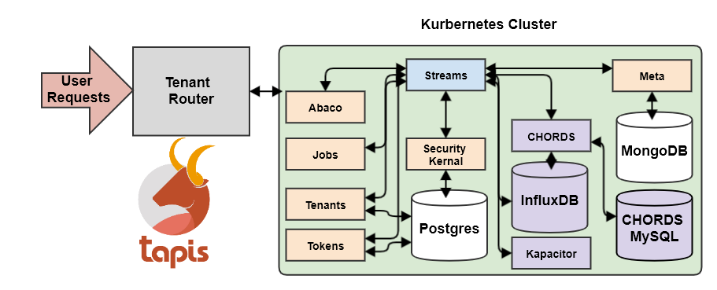

==============
Streams
==============

Projects
---------
Projects are defined at a top level in the hierarchy of Streams resources. A user registers a project by providing metadata information such as the principal Investigator, project URL, funding resource, etc. A list of authorized users can be added to various project roles to have a controlled access over the project resources. When a project is first registered, a collection is created in the back-end MongoDB. User permissions to access this collection are then set up in the security kernel. Every request to access the project resource or documents within (i.e sites, instruments, variables) goes through a security kernel check and only the authorized user requests are allowed to be processed.

**Create Project**
^^^^^^^^^^^^^^^^^^^^^

With PySDK:

.. code-block:: plaintext

        $ t.streams.create_project(project_name='tapis_demo_project_testuser6',description='test project', owner='testuser6', pi='testuser6', funding_resource='tapis', project_url='test.tacc.utexas.edu', project_id='tapis_demo_project_testuser6',active=True)

With CURL:

.. code-block:: plaintext

        $ curl -v -X POST -H "Content-Type:application/json"  -H "X-Tapis-Token:$jwt" -d '{"project_name": "tapis_demo_project_testuser6",
                                                                "project_id":"tapis_demo_project_testuser6",
                                                                "owner": "testuser6",
                                                                "pi": "testuser6",
                                                                "description": "test project",
                                                                "funding_resource": "tapis",
                                                                "project_url": "test.tacc.utexas.edu",
                                                                "active": "True"}' $BASE_URL/v3/streams/projects

The response will look something like the following:

.. container:: foldable

     .. code-block:: json

        active: True
        description: test project
        funding_resource: tapis
        owner: testuser6
        permissions:
        users: ['testuser6']
        pi: testuser6
        project_id: tapis_demo_project_testuser6
        project_name: tapis_demo_project_testuser6
        project_url: test.tacc.utexas.edu

|

**List Projects**
^^^^^^^^^^^^^^^^^^^^^
With PySDK:

.. code-block:: plaintext

        $ t.streams.list_projects()

With CURL:

.. code-block:: plaintext

        $ curl -H "X-Tapis-Token:$jwt" $BASE_URL/v3/streams/projects

The response will look something like the following:

.. container:: foldable

     .. code-block:: json

        [
         active: True
         description: project for early adopters demo
         funding_resource: tapis
         owner: testuser6
         permissions:
         users: ['testuser6']
         pi: ajamthe
         project_id: wq_demo_project12
         project_name: wq_demo_project12
         project_url: test.tacc.utexas.edu,

         active: True
         description: test project
         funding_resource: tapis
         owner: testuser6
         permissions:
         users: ['testuser6']
         pi: testuser6
         project_id: tapis_demo_project_testuser6
         project_name: tapis_demo_project_testuser6
         project_url: test.tacc.utexas.edu,
        ]

|

**Get Project Details**
^^^^^^^^^^^^^^^^^^^^^
With PySDK:

Note: project_uuid is same as project_id, used in project creation.

.. code-block:: plaintext

        $ t.streams.get_project(project_uuid='tapis_demo_project_testuser6')

With CURL:

.. code-block:: plaintext

        $ curl -H "X-Tapis-Token:$jwt" $BASE_URL/v3/streams/projects/tapis_demo_project_testuser6

The response will look something like the following:

.. container:: foldable

     .. code-block:: json

        active: True
        description: project for early demo
        funding_resource: tapis
        owner: testuser6
        permissions:
        users: ['testuser6']
        pi: testuser6
        project_id: tapis_demo_project_testuser6
        project_name: tapis_demo_project_testuser6
        project_url: test.tacc.utexas.edu

|

**Update Project**
^^^^^^^^^^^^^^^^^^^^^
With PySDK:

.. code-block:: plaintext

        $ t.streams.update_project(project_uuid='tapis_demo_project_testuser6', project_name='tapis_demo_project_testuser6', pi='testuser6', owner='testuser6', description= 'changed description',project_url='tapis_demo_project.tacc.utexas.edu')

With CURL:

.. code-block:: plaintext

        $ curl -v -X PUT -H "Content-Type:application/json"  -H "X-Tapis-Token:$jwt" -d '{"project_name": "tapis_demo_project_testuser6",
                                                                "project_uuid":"tapis_demo_project_testuser6",
                                                                "owner": "testuser6",
                                                                "pi": "testuser6",
                                                                "description": "changed description",
                                                                "funding_resource": "tapis",
                                                                "project_url": "tapis_demo_project.tacc.utexas.edu",
                                                                "active": "True"}' $BASE_URL/v3/streams/projects/tapis_demo_project_testuser6

The response will look something like the following:

.. container:: foldable

     .. code-block:: json

        active: True
        description: changed description
        funding_resource: tapis
        last_updated: 2020-07-20 17:34:58.848079
        owner: testuser6
        permissions:
        users: ['testuser6']
        pi: testuser6
        project_id: tapis_demo_project_testuser6
        project_name: tapis_demo_project_testuser6
        project_url: tapis_demo_project.tacc.utexas.edu

|

Sites
---------

Site is a geographical location that may hold one or more instruments. Sites are next in the streams hierarchy and they inherit permissions from the projects. Project owners can create sites by providing the geographical information such as latitude, longitude and elevation of the site or GeoJSON encoded spatial information. This spatial information is useful when searching sites or data based on location. In the back-end database a site is represented as a JSON document within the project collection. Site permissions are inherited from the project.

**Create Site**
^^^^^^^^^^^^^^^^^^^^^
With PySDK:

.. code-block:: plaintext

        $ t.streams.create_site(project_uuid='tapis_demo_project_testuser6',site_name='tapis_demo_site', site_id='tapis_demo_site', latitude=50, longitude = 10, elevation=2,description='test_site')

With CURL:

.. code-block:: plaintext

       $  curl -X POST -H "Content-Type:application/json" -H "X-Tapis-Token:$jwt --data '{"site_name":"tapis_demo_site","latitude":50,"longitude":10,"elevation":2,"site_id":"tapis_demo_site", "description":"test_site"}' $BASE_URL/v3/streams/projects/tapis_demo_project_testuser6/sites

The response will look something like the following:

.. container:: foldable

     .. code-block:: json

         chords_id: 27
         created_at: 2020-06-08 18:27:12.416134
         description: test_site
         elevation: 2
         latitude: 50
         location:
         coordinates: [10.0, 50.0]
         type: Point
         longitude: 10
         site_id: tapis_demo_site
         site_name: tapis_demo_site

|

**List Sites**
^^^^^^^^^^^^^^^^^^^^^
With PySDK:

.. code-block:: plaintext

        $ t.streams.list_sites(project_uuid='tapis_demo_project_testuser6')

With CURL:

.. code-block:: plaintext

        $ curl -H "X-Tapis-Token:$jwt"  $BASE_URL/v3/streams/projects/tapis_demo_project_testuser6/sites

The response will look something like the following:

.. container:: foldable

     .. code-block:: json

        [
         chords_id: 13
         created_at: 2020-07-20 19:00:55.220397
         description: demo site
         elevation: 1
         latitude: 1.0
         location:
         coordinates: [2.0, 1.0]
         type: Point
         longitude: 2
         site_id: demo_site
         site_name: demo_site,

         chords_id: 12
         created_at: 2020-07-20 18:15:25.404740
         description: test_site
         elevation: 2
         latitude: 50
         location:
         coordinates: [10.0, 50.0]
         type: Point
         longitude: 10
         site_id: tapis_demo_site
         site_name: tapis_demo_site]

|

**Get Site Details**
^^^^^^^^^^^^^^^^^^^^^
With PySDK:

.. code-block:: plaintext

        $ t.streams.get_site(project_uuid='tapis_demo_project_testuser6', site_id='tapis_demo_site1')

With CURL:

.. code-block:: plaintext

       $ curl -H "X-Tapis-Token:$jwt"  $BASE_URL/v3/streams/projects/tapis_demo_project_testuser6/sites/tapis_demo_site

The response will look something like the following:

.. container:: foldable

     $ t.streams.get_site(project_uuid='tapis_demo_project_testuser6', site_id='tapis_demo_site')

     .. code-block:: json

        chords_id: 12
        created_at: 2020-07-20 18:15:25.404740
        description: test_site
        elevation: 2
        latitude: 50
        location:
        coordinates: [10.0, 50.0]
        type: Point
        longitude: 10
        site_id: tapis_demo_site
        site_name: tapis_demo_site

|

**Update Site**: ToDo
^^^^^^^^^^^^^^^^^^^^^
With PySDK

.. code-block:: plaintext

        $

With CURL:

.. code-block:: plaintext

        $

The response will look something like the following:

.. container:: foldable

     .. code-block:: json

|

Instruments
---------------

Instruments are physical entities that may have one or more embedded sensors to sense various parameters such as temperature, relative humidity, specific conductivity, etc. These sensors referred to as variables in Streams API generate measurements, which are stored in the influxDB along with a ISO8601 timestamp. Instruments are associated with specific sites and projects. Information about the instruments such as site and project ids, name and description of the instrument, etc. are stored in the mongoDB sites JSON document.

**Create Instrument**
^^^^^^^^^^^^^^^^^^^^^

With PySDK

.. code-block:: plaintext

        $ t.streams.create_instrument(project_uuid='tapis_demo_project_testuser6',topic_category_id ='2',site_id='tapis_demo_site',  inst_name='tapis_demo_instrument',inst_description='demo instrument', inst_id='tapis_demo_instrument')

With CURL:

.. code-block:: plaintext

        $ curl -v -X POST -H "Content-Type:application/json" -H "X-Tapis-Token:$jwt" --data '{"project_uuid":"tapis_demo_project_testuser6","topic_category_id":"2","site_id":"tapis_demo_site","inst_name":"tapis_demo_instrument","inst_description":"demo instrument", "inst_id":"tapis_demo_instrument"}'  $BASE_URL/v3/streams/projects/tapis_demo_project_testuser6/sites/tapis_demo_site/instruments

The response will look something like the following:

.. container:: foldable

     .. code-block:: json

        chords_id: 10
        created_at: 2020-07-20 20:09:11.990814
        inst_description: demo instrument
        inst_id: tapis_demo_instrument
        inst_name: tapis_demo_instrument
        topic_category_id: 2

|

**List Instruments**
^^^^^^^^^^^^^^^^^^^^^

With PySDK

.. code-block:: plaintext

        $ t.streams.list_instruments(project_uuid='tapis_demo_project_testuser6', site_id='tapis_demo_site')

With CURL:

.. code-block:: plaintext

        $ curl -H "X-Tapis-Token:$jwt"  $BASE_URL/v3/streams/projects/tapis_demo_project_testuser6/sites/tapis_demo_site/instruments

The response will look something like the following:

.. container:: foldable

     .. code-block:: json

        [
         chords_id: 10
         created_at: 2020-07-20 20:09:11.990814
         inst_description: demo instrument
         inst_id: tapis_demo_instrument
         inst_name: tapis_demo_instrument
         topic_category_id: 2,

         chords_id: 11
         created_at: 2020-07-20 20:14:20.512383
         inst_description: demo instrument
         inst_id: tapis_demo_instrument
         inst_name: tapis_demo_instrument1
         project_uuid: tapis_demo_project_testuser6
         site_id: tapis_demo_site
         topic_category_id: 2,

         chords_id: 12
         created_at: 2020-07-20 20:20:45.171473
         inst_description: demo instrument
         inst_id: demo_instrument
         inst_name: demo_instrument
         topic_category_id: 2,

         chords_id: 13
         created_at: 2020-07-20 20:21:52.842495
         inst_description: demo instrument
         inst_id: demo_instrument_aj
         inst_name: demo_instrument_aj
         topic_category_id: 2]

|

**Get instrument Details**
^^^^^^^^^^^^^^^^^^^^^
With PySDK

.. code-block:: plaintext

        $ t.streams.list_instruments(project_uuid='tapis_demo_project_testuser6', site_id='tapis_demo_site',inst_id='demo_instrument')

With CURL:

.. code-block:: plaintext

        $ curl -H "X-Tapis-Token:$jwt"  $BASE_URL/v3/streams/projects/tapis_demo_project_testuser6/sites/tapis_demo_site/instruments/demo_instrument

The response will look something like the following:

.. container:: foldable

     .. code-block:: json

        chords_id: 12
        created_at: 2020-07-20 20:20:45.171473
        inst_description: demo instrument
        inst_id: demo_instrument
        inst_name: demo_instrument
        topic_category_id: 2

|

**Update Instrument**: ToDo
^^^^^^^^^^^^^^^^^^^^^
With PySDK

.. code-block:: plaintext

        $
With CURL:

.. code-block:: plaintext

        $

The response will look something like the following:

.. container:: foldable

     .. code-block:: json

|

Variables
------------

**Create Variables**
^^^^^^^^^^^^^^^^^^^^^

With PySDK

.. code-block:: plaintext

        $ t.streams.create_variable(project_uuid='tapis_demo_project_testuser6', topic_category_id='2', site_id='tapis_demo_site', inst_id='demo_instrument', var_name='battery', shortname='bat', var_id='batv')

With CURL:

.. code-block:: plaintext

        $ curl -v -X POST -H "Content-Type:application/json" -H "X-Tapis-Token:$jwt" --data '{"project_uuid":"tapis_demo_project_testuser6", "topic_category_id":"2","site_id":"tapis_demo_site", "inst_id":"demo_instrument", "var_name":"battery", "shortname":"bat", "var_id":"batv"}'  $BASE_URL/v3/streams/projects/tapis_demo_project_testuser6/sites/tapis_demo_site/instruments/demo_instrument/variables

The response will look something like the following:

.. container:: foldable

     .. code-block:: json

        chords_id: 39
        shortname: bat
        updated_at: 2020-07-20 21:51:38.712035
        var_id: batv
        var_name: battery

|

**List Variables**
^^^^^^^^^^^^^^^^^^^^^
With PySDK

.. code-block:: plaintext

        $ t.streams.list_variables(project_uuid='tapis_demo_project_testuser6',site_id='tapis_demo_site', inst_id='demo_instrument')

With CURL:

.. code-block:: plaintext

        $ curl -H "Content-Type:application/json" -H "X-Tapis-Token:$jwt"  $BASE_URL/v3/streams/projects/tapis_demo_project_testuser6/sites/tapis_demo_site/instruments/demo_instrument/variables

The response will look something like the following:

.. container:: foldable

     .. code-block:: json

        [
         chords_id: 38
         shortname: bat
         updated_at: 2020-07-20 21:50:46.382558
         var_id: batv
         var_name: battery,

         chords_id: 39
         shortname: bat
         updated_at: 2020-07-20 21:51:38.712035
         var_id: batv
         var_name: battery,

         chords_id: 40
         inst_id: demo_instrument_1
         project_uuid: tapis_demo_project_testuser6
         shortname: bat
         site_id: tapis_demo_site
         topic_category_id: 2
         updated_at: 2020-07-20 21:56:45.555381
         var_id: batv
         var_name: battery]

|

**Get Variable Details** :ToDo
^^^^^^^^^^^^^^^^^^^^^
With PySDK

.. code-block:: plaintext

        $ t.streams.get_variable(project_uuid='tapis_demo_project_testuser6',site_id='tapis_demo_site', inst_id='demo_instrument', var_id='batv')

With CURL:

.. code-block:: plaintext

        $ curl -H "Content-Type:application/json" -H "X-Tapis-Token:$jwt"  $BASE_URL/v3/streams/projects/tapis_demo_project_testuser6/sites/tapis_demo_site/instruments/demo_instrument/variables/batv

The response will look something like the following:

.. container:: foldable

     .. code-block:: json

|

**Update Variable** :ToDo
^^^^^^^^^^^^^^^^^^^^^
With PySDK

.. code-block:: plaintext

        $
With CURL:

.. code-block:: plaintext

        $

The response will look something like the following:

.. container:: foldable

     .. code-block:: json

|

Measurements
--------------

**Create Measurements**
^^^^^^^^^^^^^^^^^^^^^

With PySDK

.. code-block:: plaintext

        $ t.streams.create_measurement(inst_id='demo_instrument',vars=[{"var_id": "batv", "value": 10}],datetime='2020-07-20T22:19:25Z')

With CURL:

.. code-block:: plaintext

        $ curl -v -X POST -H "Content-Type:application/json" -H "X-Tapis-Token:$jwt" --data '{"inst_id":"demo_instrument", "datetime":"2020-07-20T23:19:25Z", "vars":[{"var_id": "batv", "value": 10}]}'  $BASE_URL/v3/streams/measurements

The response will look something like the following:

.. container:: foldable

     .. code-block:: json

         {'message': 'Measurements Saved',
         'result': [],
         'status': 'success',
         'version': 'dev'}

|

**List Measurements**
^^^^^^^^^^^^^^^^^^^^^

With PySDK

.. code-block:: plaintext

        $ t.streams.list_measurements(inst_id='demo_instrument',start_date='2020-05-08T00:00:00Z',end_date='2020-07-21T22:19:25Z', format='csv',project_uuid='tapis_demo_project_testuser6',site_id='tapis_demo_site')

With CURL:

.. code-block:: plaintext

        $ curl -H "X-Tapis-Token:$jwt"  $BASE_URL/v3/streams/measurements/demo_instrument

The response will look something like the following:

.. container:: foldable

     .. code-block:: json

        b'time,batv\n2020-07-20T22:19:25Z,10.0\n2020-07-20T23:19:25Z,10.0\n'

|

Channels
------------
**Create Channels**
^^^^^^^^^^^^^^^^^^^^^

With PySDK

.. code-block:: plaintext

        $ t.streams.create_channels(channel_id="demo.tapis.channel", channel_name='demo.tapis.channel', template_id="demo_channel_template",triggers_with_actions=[{"inst_ids":["demo_instrument"],"condition":{"key":"demo_instrument.batv","operator":">", "val":20},"action":{"method":"ACTOR","actor_id" :"XXXX","message":"Instrument: demo_instrument exceeded threshold", "abaco_base_url":"https://api.tacc.utexas.edu","nonces":"XXXX-YYYY-ZZZZ" }}])

With CURL:

.. code-block:: plaintext

        $ curl -v -X POST -H "Content-Type:application/json" -H "X-Tapis-Token:$jwt" --data '{"channel_id":"demo.tapis.channel","channel_name":"demo.tapis.channel_1","template_id":"demo_channel_template","triggers_with_actions":[{"inst_ids":["demo_instrument"],"condition":{"key":"demo_instrument.batv","operator":">", "val":"20"}, "action":{"method":"ACTOR","actor_id" :"XXXX","message":"Instrument: demo_instrument batv exceeded threshold", "abaco_base_url":"https://api.tacc.utexas.edu","nonces":"XXXX-YYYY-ZZZZ"}}]}'  $BASE_URL/v3/streams/channels

The response will look something like the following:

.. container:: foldable

     .. code-block:: json

        channel_id: demo.tapis.channel
        channel_name: demo.tapis.channel
        create_time: 2020-07-21 03:02:51.755215
        last_updated: 2020-07-21 03:02:51.755227
        permissions:
        users: ['testuser6']
        status: ACTIVE
        template_id: demo_channel_template
        triggers_with_actions: [
        action:
        abaco_base_url: https://api.tacc.utexas.edu
        actor_id: XXXX
        message: Instrument: demo_instrument exceeded threshold
        method: ACTOR
        nonces: XXXX-YYYY-ZZZZ
        condition:
        key: demo_instrument.batv
        operator: >
        val: 20
        inst_ids: ['demo_instrument']]

|

**List Channels**
^^^^^^^^^^^^^^^^^^^^^

With PySDK

.. code-block:: plaintext

        $ t.streams.list_channels()

With CURL:

.. code-block:: plaintext

        $ curl -H "X-Tapis-Token:$jwt"  $BASE_URL/v3/streams/channels

The response will look something like the following:

.. container:: foldable

     .. code-block:: json

        {'message': 'Channels found',
         'result': [],
         'status': 'success',
         'version': 'dev'}

|

**Get Channel Details**
^^^^^^^^^^^^^^^^^^^^^

With PySDK

.. code-block:: plaintext

        $ t.streams.get_channel(channel_id='demo.tapis.channel')

With CURL:

.. code-block:: plaintext

        $ curl -H "X-Tapis-Token:$jwt"  $BASE_URL/v3/streams/channels/demo.tapis.channel

The response will look something like the following:

.. container:: foldable

     .. code-block:: json

        channel_id: demo.tapis.channel
        channel_name: demo.tapis.channel
        create_time: 2020-07-21 03:02:51.755215
        last_updated: 2020-07-21 03:02:51.755227
        permissions:
        users: ['testuser6']
        status: ACTIVE
        template_id: demo_channel_template
        triggers_with_actions: [
        action:
        abaco_base_url: https://api.tacc.utexas.edu
        actor_id: XXXX
        message: Instrument: demo_instrument exceeded threshold
        method: ACTOR
        nonces: XXXX-YYYY-ZZZZ
        condition:
        key: demo_instrument.batv
        operator: >
        val: 20
        inst_ids: ['demo_instrument']]
|

**Update Channels**:ToDo
^^^^^^^^^^^^^^^^^^^^^

With PySDK

.. code-block:: plaintext

        $
With CURL:

.. code-block:: plaintext

        $

The response will look something like the following:

.. container:: foldable

     .. code-block:: json

|

**Update Channels Status**
^^^^^^^^^^^^^^^^^^^^^

With PySDK

.. code-block:: plaintext

        $ t.streams.update_status(channel_id='demo.tapis.channel', status='INACTIVE')
With CURL:

.. code-block:: plaintext

        $ curl -X POST -H "Content-Type:application/json" -H "X-Tapis-Token:$jwt" -d '{"status":"INACTIVE"}' $BASE_URL/v3/streams/channels/demo.tapis.channel

The response will look something like the following:

.. container:: foldable

     .. code-block:: json
        channel_id: demo.tapis.channel
        channel_name: demo.tapis.channel
        create_time: 2020-07-21 03:02:51.755215
        last_updated: 2020-07-22 18:09:19.940080
        permissions:
        users: ['testuser6']
        status: INACTIVE
        template_id: demo_channel_template
        triggers_with_actions: [
        action:
        abaco_base_url: https://api.tacc.utexas.edu
        actor_id: XXXX
        message: Instrument: demo_instrument exceeded threshold
        method: ACTOR
        nonces: XXXX-YYYY-ZZZZ
        condition:
        key: demo_instrument.batv
        operator: >
        val: 90
        inst_ids: ['demo_instrument']]

|

Templates
-----------
**Create Template**
^^^^^^^^^^^^^^^^^^^^^

With PySDK

.. code-block:: plaintext

        $ t.streams.create_template(template_id='test_template_for_tutorial', type='stream',
                script=' var crit lambda \n var channel_id string\n stream\n    |from()\n        .measurement(\'tsdata\')\n        '
                       ' .groupBy(\'var\')\n   |alert()\n       '
                       ' .id(channel_id +  \' {{ .Name }}/{{ .Group }}/{{.TaskName}}/{{index .Tags \"var\" }}\')\n         .crit(crit)\n    .noRecoveries()\n      '
                       '  .message(\'{{.ID}} is {{ .Level}} at time: {{.Time}} as value: {{ index .Fields \"value\" }} exceeded the threshold\')\n       '
                       ' .details(\'\')\n         .post()\n         .endpoint(\'api-alert\')\n     .captureResponse()\n    |httpOut(\'msg\')', _tapis_debug=True)

With CURL: ToDo

The response will look something like the following:

.. container:: foldable

     .. code-block:: json

        create_time: 2020-07-22 15:30:58.244391
        last_updated: 2020-07-22 15:30:58.244407
        permissions:
        users: ['testuser6']
        script:  var crit lambda
         var channel_id string
         stream
            |from()
                .measurement('tsdata')
                 .groupBy('var')
           |alert()
                .id(channel_id +  ' {{ .Name }}/{{ .Group }}/{{.TaskName}}/{{index .Tags "var" }}')
                 .crit(crit)
            .noRecoveries()
                .message('{{.ID}} is {{ .Level}} at time: {{.Time}} as value: {{ index .Fields "value" }} exceeded the threshold')
                .details('')
                 .post()
                 .endpoint('api-alert')
             .captureResponse()
            |httpOut('msg')
        template_id: test_template_for_tutorial
        type: stream

|

**List Templates**
^^^^^^^^^^^^^^^^^^^^^
With PySDK

.. code-block:: plaintext

        $ t.streams.list_templates()

With CURL:

.. code-block:: plaintext

        $ curl -H "X-Tapis-Token:$jwt"  $BASE_URL/v3/streams/templates

The response will look something like the following:

.. container:: foldable

     .. code-block:: json
        {'message': 'Templates found',
         'result': [],
         'status': 'success',
         'version': 'dev'}

|
**Get Template Details**
^^^^^^^^^^^^^^^^^^^^^
With PySDK

.. code-block:: plaintext

        $ t.streams.get_template(template_id='test_template_for_tutorial')

With CURL:

.. code-block:: plaintext

        $ curl  -H "X-Tapis-Token:$jwt" $BASE_URL/v3/streams/templates/test_template_for_tutorial

The response will look something like the following:

.. container:: foldable

     .. code-block:: json

        create_time: 2020-07-22 15:30:58.244391
        last_updated: 2020-07-22 15:30:58.244407
        permissions:
        users: ['testuser6']
        script:  var crit lambda
         var channel_id string
         stream
            |from()
                .measurement('tsdata')
                 .groupBy('var')
           |alert()
                .id(channel_id +  ' {{ .Name }}/{{ .Group }}/{{.TaskName}}/{{index .Tags "var" }}')
                 .crit(crit)
            .noRecoveries()
                .message('{{.ID}} is {{ .Level}} at time: {{.Time}} as value: {{ index .Fields "value" }} exceeded the threshold')
                .details('')
                 .post()
                 .endpoint('api-alert')
             .captureResponse()
            |httpOut('msg')
        template_id: test_template_for_tutorial
        type: stream

|

**Update Template**:ToDo
^^^^^^^^^^^^^^^^^^^^^
With PySDK

.. code-block:: plaintext

        $

With CURL:

.. code-block:: plaintext

        $

The response will look something like the following:

.. container:: foldable

     .. code-block:: json

|

Alerts
-----------

**List Alerts**:
^^^^^^^^^^^^^^^^^^^^^

With PySDK

.. code-block:: plaintext

        $ t.streams.list_alerts(channel_id='demo_wq_channel2020-06-19T17_34_46.425419')

With CURL:

.. code-block:: plaintext

        $ curl  -H "X-Tapis-Token:$jwt" $BASE_URL/v3/streams/channels/demo_wq_channel2020-06-19T17_34_46.425419/alerts

The response will look something like the following:

.. container:: foldable

     .. code-block:: json
        alerts: [
            actor_id: XXXX
            alert_id: 70fa63b4-c6b1-45a4-91a8-f4e9803ec898
            channel_id: demo_wq_channel2020-06-19T17_34_46.425419
            channel_name: demo.wq.channel
            create_time: 2020-06-19 20:51:44.390887
            execution_id: 7mBGaJbD4q0M1
            message: demo_wq_channel2020-06-19T17_34_46.425419 tsdata/var=11/demo_wq_channel2020-06-19T17_34_46.425419/11 is CRITICAL at time: 2020-06-19 20:51:43.229988 +0000 UTC as value: 150 exceeded the threshold,
            actor_id: XXXX
            alert_id: c16ab843-8417-4af0-a06c-ce1e4e7e4816
            channel_id: demo_wq_channel2020-06-19T17_34_46.425419
            channel_name: demo.wq.channel
            create_time: 2020-06-19 20:51:21.138143
            execution_id: ByOkp5W8Jxkqj
            message: demo_wq_channel2020-06-19T17_34_46.425419 tsdata/var=11/demo_wq_channel2020-06-19T17_34_46.425419/11 is CRITICAL at time: 2020-06-19 20:51:20.114319 +0000 UTC as value: 150 exceeded the threshold,
            actor_id: XXXX
            alert_id: 4c4b7e70-a034-419b-be8c-2c337803e5d4
            channel_id: demo_wq_channel2020-06-19T17_34_46.425419
            channel_name: demo.wq.channel
            create_time: 2020-06-19 20:51:10.454269
            execution_id: jboJWNqRKAA6V
            message: demo_wq_channel2020-06-19T17_34_46.425419 tsdata/var=11/demo_wq_channel2020-06-19T17_34_46.425419/11 is CRITICAL at time: 2020-06-19 20:51:09.862752 +0000 UTC as value: 150 exceeded the threshold]
            num_of_alerts: 3
        ]
|
